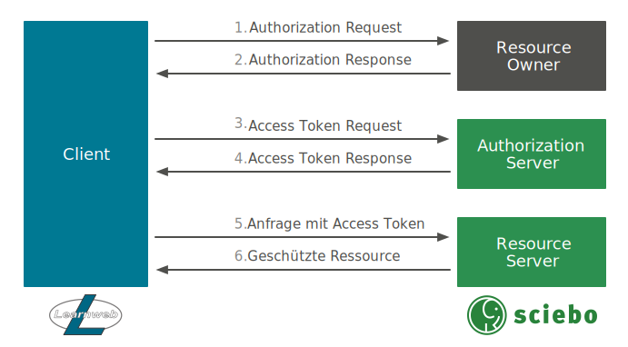

# sciebo@Learnweb
Diese Website dokumentiert die Integration von [sciebo](https://www.sciebo.de/) in das [Learnweb](https://www.uni-muenster.de/LearnWeb/learnweb2/)
von dem Projektseminar [sciebo@Learnweb](https://www.wi.uni-muenster.de/de/studierende/lehrangebot/227197), das im Wintersemester 2016/17 an der [Westfälischen Wilhelms-Universität Münster](http://www.uni-muenster.de/) stattgefunden hat.

Sciebo ist ein Cloud-Dienst, der gemeinsam von 26 Hochschulen und Forschungseinrichtungen in NRW angeboten wird. Als Grundlage dient die Enterprise-Edition von [ownCloud](https://owncloud.org/).
Das Learnweb ist ein auf der Open-Source-Lösung [Moodle](https://moodle.org/) basierendes E-Learning System der Westfälischen Wilhelms-Universität Münster.

Eine mögliche Lösung sollte dabei möglichst allgemein einsetzbar sein, da die Kombination von Moodle und ownCloud an zahlreichen Universitäten genutzt wird.

## User Stories
Als Integrationsszenarien der Systeme wurden verschiedene User Stories entwickelt.
Diese haben wir nach Schwere, Interesse, Benutzbarkeit und Implementationsaufwand priorisiert.
Als Integrationsrichtung konzentrierte wir uns auf die Richtung Learnweb <i class="fa fa-long-arrow-right" aria-hidden="true"></i> sciebo.
Während des Projektseminars konnten wir folgende Use Cases implementieren:

#### 1. Als **Nutzer** möchte ich OAuth2 benutzen können, um mich im Learnweb als Sciebo Nutzer anzumelden.

Dieser Use Case implementiert die grundlegende Authentifizierung mit dem [OAuth 2.0](https://oauth.net/2/) Verfahren.
Im Rahmen unserer Vorbereiungsphase auf das Projektseminar haben wir verschiedene Authentifizierungsmethoden evaluiert. Im Abschnitt
 [Authentifizierung und Autorisierung](#authentifizierung-und-autorisierung) finden sie hierfür genauere Informationen. Hierfür ist in Moodle das
 [Admin Tool](/moodle/admin-tool.md) implementiert worden. Es übernimmt sämtliche Aufgaben der Authentifizierung. Alle anderen Plugins nutzen dieses Tool.
 In OwnCloud wurde hierfür eine [App](/owncloud/technische-umsetzung.md) entwickelt.

#### 2. Als **Nutzer** möchte ich in der Dateiauswahl im Learnweb eine Datei aus meiner sciebo Instanz hochladen.

Der vorherige Use Case war für den Benutzer der Moodle Instanz noch nicht sichtbar. Das wichtigste Anwendungsszenario ist das Nutzer im Learnweb Dateien aus ihrer
Sciebo Account hochladen können. Hierfür haben wir in Moodle ein [Repository-Plugins](/moodle/repository.md) entwickelt. Sobald das Reposiotory einer Moodle
Instanz hinzugefügt wurde kann der Nutzer über einen anmelde Button Moodle autorisieren Dateien aus dem privaten sciebo account anzuzeigen
und mit Hilfe des File Pickers können nun Dateien ausgewählt werden.

  <strong>TODO:</strong> BILDER! (Wenn get_listing wieder funktioniert)

#### 3. Als **Nutzer** möchte ich in der Dateiauswahl im Learnweb eine Datei aus meiner sciebo Instanz verlinken.

Eine Erweiterung des vorherigen Szenarios ist die Verlinkung von Dateien. Hier wird zu der bestehenden Datei ein public-link erstellt.
Dieser kann nun von Nutzern angeklickt werden. Diese Funktionalität ist auch Teil des [Repository-Plugins](/moodle/repository.md). Das Verlinken ist
jedoch nur in der Aktivität URL verfügbar.

#### 4. Als **Lehrender** möchte ich Studierenden oder Gruppen von Studierenden Ordner für kollaboratives Arbeiten bereitstellen.

Die letzte User Story die wir implementiert haben, wurde vermehrt von Lehrenden der Universität Münster nachgefragt. Ein Lehrender kann mir Hilfe der
Aktivität [collaborativefolders](/moodle/activity.md) in einem Kurs Ordner erstellen auf den Studierende Zugriff haben und den sie ihrem sciebo account hinzufügen können.

Weitere User Storys die jedoch nicht im Rahmen diese Projektseminars implementiert werden konnten finden sie unter dem Abschnitt
[Weitere Anwendungsszenarien](#weitere-anwendungsszenarien).
## Authentifizierung und Autorisierung
Grundlegend für die Integration beider Systeme ist die Authentifizierung und Autorisierung. Unter den gängigen Verfahren, die untersucht wurden, befinden sich:

* [OAuth 2.0](https://oauth.net/2/)
* [JSON Web Tokens](https://jwt.io/)
* Federated Single Sign-on mit beispielsweise [Shibboleth](https://shibboleth.net/)

Für das Projekt wurde das OAuth 2.0 Verfahren ausgewählt, da mit ihm ein standardisiertes Verfahren zur tokenbasierten Authentifizierung und
Autorisierung vorliegt, das sich gut in bestehende Applikationen auf Basis vieler verschiedener Programmiersprachen einfügen lässt und damit keine weiteren Anforderungen an die Infrastruktur stellt.

### OAuth 2.0
Der allgemeine OAuth 2.0 Protokollablauf ist in der nachfolgenden Abbildung dargestellt.

Zunächst muss sich der Client (Learnweb), der im Namen des Resource Owners (sciebo Nutzer) auf eine geschützte Ressource auf dem Resource Server (sciebo) zugreifen möchte,
bei dem Authorization Server (sciebo) registrieren. Danach werden nach dem Protokoll folgende Schritte durchlaufen:

1. Authorization Request:
2. Authorization Response
3. Access Token Request
4. Access Token Response
5. Anfrage mittels Access Token
6. Zugriff auf geschützte Ressourcen

  <strong>TODO:</strong> Beschreibung der Schritte einfügen.

## Komponenten

  <strong>TODO:</strong> Würde ich nicht in die Index packen, sondern einzelne Komponenten nur in dem Moodle und ownCloud Unterpunkt beschreiben.

### ownCloud

### Moodle

## Zusammenspiel

## Weitere Anwendungsszenarien

Im Rahmen unseres Projektseminars haben wir uns auf die für uns wichtigsten UseCases konzentriert. Im Folgenden werden weitere Use Cases erläutert
über deren Implementierung wir nachgedacht haben und die eine Erweiterung zu den bestehenden Use Cases bilden könnten.

1. Als **Lehrender** möchte ich auf einen Button klicken, um hochgeladene Dateien zu aktualisieren.

2. Als **Studierender** möchte ich Dateien aus dem Learnweb direkt in meiner sciebo Instanz speichern können.

3. Als **Studierender** möchte ich anderen Studierenden Schreib- und Lese-Rechte geben um kollaborativ zu arbeiten.

4. Als **Lehrender** möchte ich Nutzern auf Modul-Basis das Recht entziehen eine Datei zu verlinken.

5. Als **Nutzer** möchte ich in der Dateiauswahl im Learnweb einen Ordner aus meiner sciebo Instanz hochladen.

6. Als **Lehrender** möchte ich in der Dateiauswahl im Learnweb einen Ordner aus meiner sciebo Instanz verlinken.

7. Als **Studierender** möchte ich Lehrenden Schreib- oder Lese-Rechte auf mein Dokument geben können um Feedback zu erhalten.

8. Als **Lehrender** möchte ich die Möglichkeit haben, einen Zielordner in Sciebo zur Speicherung auszuwählen, um Abgaben herunterzuladen.

9. Als **Lehrender** möchte ich sciebo als primären Speicher für alle Dateien im Kurs verwenden können.

10. Als **Lehrender** möchte ich in Sciebo die Teilen-Funktion nutzen, um Dateien oder Dokumente für Kursteilnehmer freigeben zu können.
