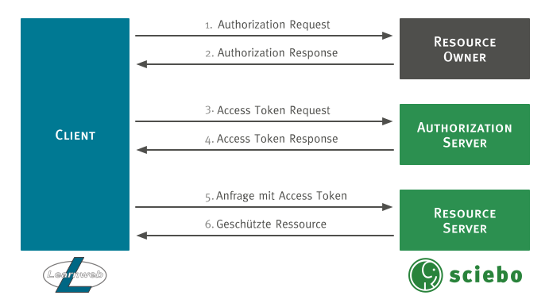

# sciebo@Learnweb
Diese Website dokumentiert das Projektseminar [sciebo@Learnweb](https://www.wi.uni-muenster.de/de/studierende/lehrangebot/227197), das im Wintersemester 2016/17 an der [Westfälischen Wilhelms-Universität Münster](http://www.uni-muenster.de/) stattgefunden hat.

Gegenstand des Projektseminars war die Integration der Systeme [sciebo](https://www.sciebo.de/) und [Learnweb](https://www.uni-muenster.de/LearnWeb/learnweb2/). Sciebo ist ein Cloud-Dienst, der gemeinsam von 26 Hochschulen und Forschungseinrichtungen in NRW angeboten wird. Als Grundlage dient die Open-Source-Lösung [ownCloud](https://owncloud.org/). Das Learnweb ist ein auf der Open-Source-Lösung [Moodle](https://moodle.org/) basierendes E-Learning System der Westfälischen Wilhelms-Universität Münster.

Eine mögliche Lösung sollte dabei möglichst allgemein einsetzbar sein, da die Kombination von Moodle und ownCloud an zahlreichen Universitäten genutzt wird.

## User Stories
Als Integrationsszenarien der Systeme wurden verschiedene User Stories entwickelt. Als Integrationsrichtung konzentrierte man sich auf die Richtung Learnweb <i class="fa fa-long-arrow-right" aria-hidden="true"></i> sciebo.

## Authentifizierung und Autorisierung
Grundlegend für die Integration beider Systeme ist die Authentifizierung und Autorisierung. Unter den gängigen Verfahren, die untersucht wurden, befinden sich:

* [OAuth 2.0](https://oauth.net/2/)
* [JSON Web Tokens](https://jwt.io/)
* Federated Single Sign-on mit beispielsweise [Shibboleth](https://shibboleth.net/)

Für das Projekt wurde das OAuth 2.0 Verfahren ausgewählt, da mit ihm ein standardisiertes Verfahren zur tokenbasierten Authentifizierung und Autorisierung vorliegt, das sich gut in bestehende Applikationen auf Basis vieler verschiedener Programmiersprachen einfügen lässt und damit keine weiteren Anforderungen an die Infrastruktur stellt.

### OAuth 2.0
Der allgemeine OAuth 2.0 Protokollablauf ist in der nachfolgenden Abbildung dargestellt.

Zunächst muss sich der Client (Learnweb), der im Namen des Resource Owners (sciebo Nutzer) auf eine geschützte Ressource auf dem Resource Server (sciebo) zugreifen möchte, bei dem Authorization Server (sciebo) registrieren. Danach werden nach dem Protokoll folgende Schritte durchlaufen:

1. Authorization Request:
2. Authorization Response
3. Access Token Request
4. Access Token Response
5. Anfrage mittels Access Token
6. Zugriff auf geschützte Ressourcen

  <strong>TODO:</strong> Beschreibung der Schritte einfügen.

## Komponenten

### ownCloud

### Moodle

## Zusammenspiel
