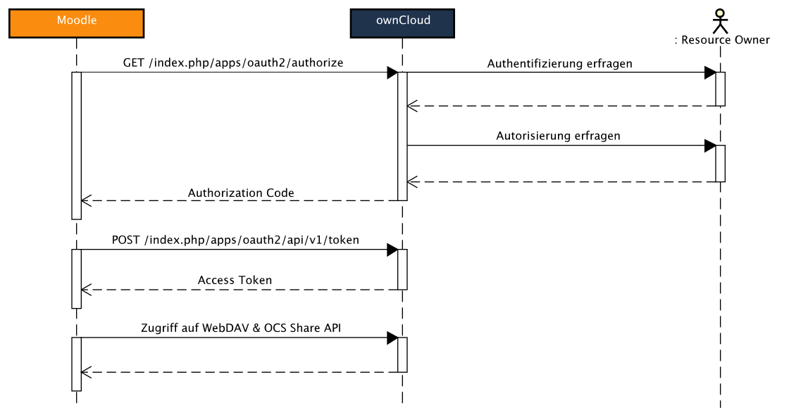

<div>
<h1> Admin Tool: <span class=code>oauth2owncloud</span></h1>
</div>

## Zweck

Wie bereits im Kapitel [Software Architektur](softwarearchitektur/) angeschnitten, ist der Hauptzweck dieses Plugins
die Schnittstelle zu ownCloud bereitzustellen. Zu diesem Zweck wird die im Projekt implementierte ownCloud
App [oauth2](../../owncloud/technische-umsetzung/oauth2-app/) mit Hilfe eines OAuth 2.0 Clients angesprochen. Zusätzlich werden
sowohl die WebDAV, als auch die OCS Share Schnittstelle, über OAuth 2.0 abgesichert, in diesem Client umfasst.
Zwar ist der Client auf einen OAuth 2.0 Protokollablauf in Zusammenarbeit mit der entsprechenden ownCloud App angepasst,
jedoch könnte er in Zukunft auch als Ausgangspunkt genutzt werden, um ähnliche Schnittstellen zu erreichen.

Im Wesentlichen implementiert dieses Plugin das folgende [Integrationsszenario](../../#realisierte-szenarien):

> Als **Nutzer** möchte ich OAuth 2.0 benutzen können, um Moodle Zugriff auf ownCloud zu gewähren.

Jedoch betrifft es auch alle anderen Szenarien indirekt, da diese erst durch die Authentifizierung mittels OAuth 2.0
ermöglicht werden können.

## Vorgegebene Schnittstelle

Für Admin Tools ist in Moodle lediglich eine schwach definierte Schnittstelle gegeben. Wie in jedem anderen Moodle Plugin 
auch, müssen zunächst einige Standarddateien implementiert werden: 

* **`version.php`:** Beschreibt die Versionsnummer des Plugins, die benötigte Moodle Version und Abhängigkeiten des Plugins.
* **`access.php`:** Legt die Berechtigungen für definierte Aktionen innerhalb des Plugins anhand von Nutzerrollen fest.
* **`tool_oauth2sciebo.php`:** Beinhaltet Sprachstrings für unterschiedliche Regionen und Sprachen, sodass definierte Strings,
abhängig von der jeweiligen Sprache, dynamisch angezeigt werden können.

Zusätzlich zu den allgemeinen Plugindateien, sollte das Admin Tool auch mindestens noch eine Datei namens `settings.php`
beinhalten. Diese umfasst alle Einstellungen, die für das Admin Tool geltend dem Administrator der Moodle Instanz zur 
Verfügung gestellt werden sollen. Nach der Eingabe, wird diese Konfiguration Moodle-intern gespeichert und kann von dem
Client, wenn nötig abgerufen werden.

Insgesamt ergibt sich folgende Struktur von Ordnern und Dateien, die mindestens für die Implementierung des benötigten
Admin Tools notwendig ist:
                                    
```nohighlight                      
classes                             # Enthält alle implementierten Klassen
db	
  └── access.php					# Enthält alle definierten Capabilities
lang
  └── en
      └── tool_oauth2sciebo.php		# Enthält Sprach-Strings (englisch) 										
pix						            # Bilder und Icons
tests                               # Test-Dateien und Generatoren
settings.php	                    # Einstellungs-Seite				
version.php						    
```

## Implementierung

Im Folgenden wird zunächst ausgeführt, wie die vorgegebenen Schnitstellen implementiert worden sind.

### Eingabemaske

Um die OAuth 2.0 und WebDAV Clients erfolgreich zum Zugriff auf eine entsprechende ownCloud Instanz zu befähigen,
müssen diese zunächst mit Hilfe benötigter Eingabedaten konfiguriert werden. Diese sollen zentral im Admin Tool eingegeben und
gespeichert werden können, um sie anschließend von dem Client aus, und damit auch in den ihn verwendenden Plugins, nutzen zu können.

#### Benötigte Eingaben

Um den OAuth 2.0 Protokollablauf zu ermöglichen, müssen folgende Daten im Vorfeld erfasst werden:

* **`Client ID`:** wird in ownCloud generiert und dient der Identifizierung eines regstrierten Clients.
* **`Secret`:** wird ebenfalls in ownCloud generiert und zur Authentifizierung verwendet.

Beide Datensätze sind Strings bestehend aus Buchstaben und Zahlen. Daher eignet sich für beide ein Textfeld, welches ausschließlich
alphanumerische Werte erwartet, zur Eingabe.

Zur Nutzung des WebDAV Clients werden darüber hinaus folgende Daten benötigt:

* **`Server Addresse`:** Url über die der ownCloud Server erreicht werden kann.
* **`Server Pfad`:** der angehangene Pfad, über den die WebDAV Schnittstelle erreicht werden kann.
* **`Port`:** Port des WebDAV-Servers.
* **`Protokoll`:** Wahl zwischen HTTP und HTTPS.

Während die Wahl des Protokolls mittels einer Auswahl aus vorhandenen Optionen abgeboten werden kann, müssen die restlichen Werte
in einem Textfeld erfragt werden. Auch in diesem Fall werden die Variablen nach den zu erwartenden Werten gesäubert. Darüber hinaus
werden alle Eingaben, bis auf den Port, als notwendig angesehen.

#### Settings
 
Die nun benötigten Eingabedaten müssen in Moodle auf der Einstellungsseite des Plugins erfragt und entprechend gespeichert werden.
Um dies zu bewerkstelligen wird in der settings.php jedes Eingabefeld einzeln definiert. In dem folgenden Beispiel wird das
Eingabfeld für die Client ID beschrieben:

```php
$setting = new admin_setting_configtext('tool_oauth2owncloud/clientid',
        get_string('clientid', 'tool_oauth2owncloud'),
        get_string('help_oauth_param', 'tool_oauth2owncloud', 'client identifier'), '', PARAM_ALPHANUM, '64');
$settings->add($setting);
```

Die Definition des Feldes beinhaltet den Ort, an dem die Eingabe gespeichert wird und dementsprechend wiedergefunden werden kann.
In diesem Fall wird die Eingabe unter den Plugin-spezifischen Einstellungen hinterlegt. Weiterhin werden der Name des Feldes
(so wie er dem Nutzer angezeigt wird), ein Beschreibungstext und Standardwert (in diesem Fall bleibt es leer) für das Feld angegeben.
Zuletzt werden der Typ (in diesem Fall alphanumerisch) und die Länge der erwarteten Eingabe festgelegt.

Die Einstellungsseite wird anschließend in die Kategorie der Admin Tools eingeordnet, wo sie von dem Seitenadministrator wiedergefunden
werden kann.

Der Administrator kann die Einstellungen jederzeit ändern und damit die gewünschte Schnittstelle konfigurieren und gegebenenfalls anpassen.

### OAuth 2.0 Client

Den funktionalen Kern des Plugins stellt der OAuth 2.0 ownCloud Client dar. Dieser befindet sich in Form der Klasse `owncloud` in der
Datei `sciebo.php` in dem `classes` Ordner des Plugins. Diese Klasse steuert sowohl den Moodle-seitigen Protokollablauf
von OAuth 2.0, als auch den Verbindungsaufbau zu ownCloud mittels WebDAV und OCS Share API. Dadurch, dass `owncloud` von der im Moodle Core
enthaltenen Klasse `oauth2_client` erbt, ist ein Großteil des Protokollablaufs bereits abgedeckt.
Der Konstruktor der Klasse `oauth2_client` muss mit den `Client ID` und `Secret` Daten aufgerufen werden.
Diese werden aus den zuvor angewandten Einstellungen beschafft:

```php
public function __construct($callback) {
    $server = get_config('tool_oauth2owncloud', 'server');
    $clientid = get_config('tool_oauth2owncloud', 'clientid');
    $secret = get_config('tool_oauth2owncloud', 'secret');
    $protocol = get_config('tool_oauth2owncloud', 'protocol');
    $port = get_config('tool_oauth2owncloud', 'port');
    $path = get_config('tool_oauth2owncloud', 'path');

    parent::__construct($clientid, $secret, $callback, '');
```

Zu diesem Zweck wird die Methode `get_config` verwendet. Sie gibt den für ein Plugin und einen zuvor einzigartig definierten
Namen aus den Einstellungen heraus den dazu gespeicherten Wert.
Darüber hinaus muss eine `callback URL` angefügt werden, die den Pfad angibt, an den nach der Authentifizierung und Authorisierung
der Nutzer weitergeleitet werden soll. Dieser wird allerdings extern in den Anwendungen erzeugt, die den `owncloud` Client benutzen.

Zu beachten ist, dass für die Klasse `owncloud` ein *namespace* definiert wird, womit diese effizient in externen Plugins verwendet werden
kann, die einen OAuth 2.0 ownCloud Client benötigen.

Weiterhin müssen die Methoden `auth_url` und `token_url` der Elternklasse zwingend implementiert werden, um bei der Authentifizierung
und der Token-Beschaffung auf die richtigen Pfade zu verweisen:

```php
protected function auth_url() {
    // Dynamically generated from the admin tool settings.
    return $this->prefixoc . 'index.php/apps/oauth2/authorize';
}

protected function token_url() {
    return $this->prefixoc . 'index.php/apps/oauth2/api/v1/token';
}
```

Hierfür werden die beiden Pfade aus der Serveraddresse, dem Port und dem Serverpfad berechnet, da der Endpunkt für die oauth2 App in
ownCloud gleich bleibt. Die benötigten Eingabdaten werden, soweit angegeben, der Eingabemaske entnommen.

## Erweiterungen der Schnittstellen

Da zur Umsetzung des Verfahrens die vorgegebenen Schnittstellen nicht ausreichten, mussten in Anpassungen in Moodle Core 
Bibliotheken vorgenommen werden. Im Folgenden werden diese Änderungen beschrieben.

### OAuth 2.0 Client

#### Anpassung der `post` Methode

Die Moodle-interne Klasse `oauth2_client` erbt von einer weiteren Klasse aus dem Moodle Core mit dem Namen `curl`, welche mittels
[cURL](https://de.wikipedia.org/wiki/CURL) HTTP Requests erstellen und verschicken kann. Dadurch ist die Klasse fähig eigenständig einen Access Token mit einem 
Authorization Code mittels der HTTP POST Methode über die `token` Schnittstelle in ownCloud zu beschaffen. Allerdings
bietet die dafür zuständige Methode `post` nicht die Möglichkeit einen Basic Authorization Header zur Anfrage hinzuzufügen,
welcher Client ID und Secret zur Autorisierung in der `oauth2` ownCloud App mit verschickt. Daher musste die `post` Methode
in der `owncloud` Klasse so überschrieben werden, dass der benötigte Header vor dem Aufruf der geerbten Methode gesetzt wird:

```php
public function post($url, $params = '', $options = array(), $auth = false) {

    if ($auth == false) {
        $this->setHeader(array(
                'Authorization: Basic ' . base64_encode($this->get_clientid() . ':' . $this->get_clientsecret())
        ));
        
        $this->log_out();
    }

    return parent::post($url, $params, $options);
}
```

Der entsprechende Header wird nur dann gesetzt, wenn ein Access Token angefordert werden soll. Um nicht zusätzlich einen
Authentication Header mit einem abgelaufenen Access Token zu versenden, muss dieses Access Token mittels `log_out()` 
entfernt werden.

#### Erweiterung des Access Tokens

Ein in der Eltern-Klasse `oauth2_client` erhaltenes Access Token verfügt über die Attribute `token`, was die Zeichenkette des Tokens
beinhaltet, und `expires`, welches das Ablaufdatum des Tokens angibt. Da jedoch von der oauth2 ownCloud App darüber hinaus noch die
Attribute `refresh_token` und `user_id` versandt werden und für einige Integrationsszenarien gebraucht werden, musste das Access Token
im OAuth 2.0 ownCloud Client, nach dem Upgrade aus einem Authorization Code, um eben diese Eigenschaften erweitert werden:

```php
$r = upgrade($code);

$accesstoken = new stdClass;
$accesstoken->token = $r->access_token;
$accesstoken->expires = (time() + ($r->expires_in - 10));
$accesstoken->user_id = $r->user_id;
$accesstoken->refresh_token = $r->refresh_token;

$this->store_token($accesstoken);
```

#### Einführung des Refresh Tokens

Da nun das Access Token um die fehlende Eigenschaft `refresh_token` ergänzt worden ist, musste der Client ebenfalls um die
Fähigkeit, ein Refresh Token zu einem Access Token aufzuwerten, erweitert werden. Hierzu musste einerseits an der Stelle
eingegriffen werden, an der das aktuelle Access Token geprüft wird. Ist das aktuelle Access Token abgelaufen und ein Refresh
Token vorhanden, so muss versucht werden ein neues Access Token mit Hilfe des Refresh Tokens anzufordern. Dabei wird dieselbe
Schnittstelle verwendet, die auch zum Aufwerten eines Authorization Codes zum Einsatz kommt. Daher muss bei der Ausführung der
Methode `upgrade_token` zwischen Refresh Token und Authorization Code unterschieden werden:

```php
if ($refresh == false) {
    $grant = 'authorization_code';
    $type = 'code';
} else {
    $grant = 'refresh_token';
    $type = 'refresh_token';
}

$params = array(
        'grant_type' => $grant,
        $type => $code,
        'redirect_uri' => $callbackurl->out(false),
);

$response = $this->post($this->token_url(), $params);
```

Die übergebenen Parameter der HTTP POST Methode müssen, wie in dem Protokollablauf spezifiziert, jeweils auf den Typ der
aufzuwertenden Zeichenkette (`code` vs. `refresh_token`) angepasst werden. Im Fall eines Erfolges sollten beide Anfrage-Typen
ein Access Token zurückliefern.

#### Speicherung Nutzer-spezifischer Access Tokens

Um einen hohen Grad an Komfort und Sicherheit gewährleisten zu können, musste dem Nutzer die Möglichkeit eines einmaligen
Logins gegeben werden. Durch die Einführung eines Refresh Tokens wurde der erste Schritt in diese Richtung getätigt, da nun
das Access Token, im Normalfall, immer wieder aufgewertet werden kann, ohne dass man sich erneut in ownCloud authentifizieren muss.
Weiterhin wurde der OAuth 2.0 ownCloud Client um eine Methode `check_login` ergänzt, welche nach Erhalt eines Access Tokens
dieses innerhalb der persönlichen Einstellungen des aktuellen Nutzers hinterlegt und, falls vorhanden, bei der Prüfung des
Login-Status auch daraus bezieht.

Darüber hinaus bietet die Methode `check_login` auch die Möglichkeit ein Access Token für ein spezielles, angegebenes Plugin
zu speichern, um zum Beispiel einen technischen Nutzer in ownCloud zu verwenden.

### WebDAV Client

Da ownCloud Datentransfer lediglich über eine WebDAV Schnittstelle anbietet, musste auf diese in Moodle mittels eines dafür
vorgesehenen Clients zugegriffen werden können. Moodle bietet bereits einen WebDAV Client an, welcher als Basis für ownClouds
WebDAV Schnittstelle verwendet werde konnte.

#### Absicherung mittels OAuth 2.0

Der Moodle-interne Client bietet eine große Auswahl an WebDAV Methoden, welche zum Großteil erfolgreichen Datentransfer mit
ownCloud ermöglichen. Der Nachteil des Client besteht darin, dass er ausschließlich mit [Basic Auth](https://tools.ietf.org/html/rfc2617) ausgestattet ist und somit
bei jedem Zugriff Nutzername und Passwort des ownCloud Accounts versandt werden muss. Um eine passwortlose Authentifizierung
zu ermöglichen, musste der WebDAV Client mittles OAuth 2.0 abgesichert werden.

In der Umsetzung wurde der Client mit einem Access Token ausgestattet, welches bei jedem Zugriff, innerhalb eines Bearer
Authentication Headers, an ownCloud mitversandt wird:

```php
private function create_basic_request($method) {
    // ...Füge die benötigten Header hinzu.
    if ($this->_auth == 'basic') {
        $this->header_add(sprintf('Authorization: Basic %s', 
                    base64_encode("$this->_user:$this->_pass")));
    } else if ($this->_auth == 'bearer') {
        $this->header_add(sprintf('Authorization: Bearer %s', 
                    $this->_token));
    }
}
```

ownCloud-seitig wird der Header erkannt und statt einer Kombintion aus Nutzernamen und Passwort, das übergebene Access Token
ausgewertet. Wenn das Access Token noch gültig ist, wird die Anfrage ganz normal behandelt.

#### Weiterleitungen

Um den OAuth 2.0 und den WebDAV Client miteinander zu kombinieren, wurden Weiterleitungs-Methoden implementiert, welche die
von weiteren Integrationsszenarien benötigten Zugriffe auf die WebDAV Schnittstelle über den OAuth 2.0 ownCloud Client
weiterleiten. Dieser setzt zunächst ein gültiges Access Token und ruft dann die entsprechende WebDAV Methode über den WebDAV
Client auf. Im folgenden Beispiel wird der Aufruf der Methode MKCOL gezeigt:

```php
public function make_folder($path) {
    $this->dav->set_token($this->get_accesstoken()->token);
    return $this->dav->mkcol($this->prefixwebdav . $path);
}
```

Der Pfad zur WebDAV Schnittstelle des ownCloud Servers wird bereits im Konstruktor der Klasse `owncloud` aus Angaben in der
Eingabemaske zusammengestellt.

### OCS Share API

Auch ownClouds OCS Share API wird zur Abdeckung einiger Intergrationsszenarien benötigt, da sie sowohl zum Teilen von privaten
Inhalten, als auch zum Generieren öffentlicher Links gebraucht werden kann. Mussten zuvor noch Nutzername und Passwort bei jedem
Zugriff auf diese Schnittstelle zwingend zur Authentifizierung angegeben werden, reicht durch das Setzen eines Bearer Authentication
Headers nun auch ein von ownCloud erhaltenes Access Token. Somit ist auch diese Schnittstelle nun mittels OAuth 2.0 abgesichert.

## Integration mit ownCloud

Nachdem die nötigen Schnittstellen individuell implementiert worden sind, können sie genutzt werden um den von OAuth 2.0 spezifizierten
Protokollablauf Moodle-seitig durchzuführen. Um beispielsweise über eine WebDAV Anfrage Daten aus einer ownCloud Instanz 
beschaffen zu können, müssen im Wesentlich folgende Schritte in Moodle unternommen werden, nachdem die Eingabemaske korrekt 
ausgefüllt worden ist:

1. Anfrage auf **Authentifizierung und Autorisierung**
2. Anfrage eines **Access Tokens**
3. Zugriff auf die **WebDAV** Schnittstelle

Der damit vollzogene Ablauf lässt sich in folgender Grafik erfassen:



Diese Schritte werden im Folgenden erläutert.

### Authentifizierung und Autorisierung

Sobald ein Nutzer in Moodle zum ersten Mal mittels OAuth 2.0 auf ownCloud zugreifen möchte, müssen in ownCloud dessen
Authentifizierung und Autorisierung erfragt werden. Zu diesem Zweck wird der Nutzer mittels eines Links an die `authorize`
Schnittstelle der oauth2 App in ownCloud weitergeleitet. Dabei werden die im Authorization Code Flow aufgeführten Parameter,
welche zur Bearbeitung der Autorisierungsanfrage nötig sind, angefügt. Während `respone_type`, `client_id` und `redirect_uri`
stets gleich bleiben, beziehungsweise von der vorgenommenen Konfiguration abhängig sind, wird der `state` Moodle-intern
von der Anwendung gestellt, welche den Client benutzt. Der `state` Parameter gibt an, wohin in Moodle weitergeleitet werden
soll, nachdem eine erfolgreiche Anfrage gestellt worden ist. Somit dient `state` in Moodle der Wiederherstellung des Standes,
an dem der Nutzer sich vor der Anfrage befand. Im Fall des ownCloud Repository Plugins wird, wie im folgenden gezeigt,
auf eine Moodle-interne Adresse verwiesen, die den Status eines Repositories in dem File Picker wiederherstellt.

```php
$returnurl = new moodle_url('/repository/repository_callback.php', [
        'callback'  => 'yes',
        'repo_id'   => $repositoryid,
        'sesskey'   => sesskey(),
]);
```

Falls die Anfrage erfolgreich verläuft, erhält der Client einen Authorization Code, welcher ihn zur Anfrage eines Access Tokens
bemächtigt.

Die Autorisierung durch den Nutzer stellt die einzige für diesen sichtbare Schnittstelle dar.

### Anfrage eines Access Tokens

Um einen Authorization Code zu einem Access Token aufzuwerten muss mittels einer POST-Anfrage die `token` Schnittstelle
der oauth2 App in ownCloud angesprochen werden. Erneut müssen alle 
[spezifizierten Angaben](../../owncloud/technische-umsetzung/oauth2-app/#authorization-code-flow) in dem Request übergeben werden,
unter Anderem der Authorization Code. Da ownCloud-seitig zusätzlich ein Basic Authentication Header mit Client ID und
Client Secret zur Authentifizierung erwartet wird, muss dieser zusätzlich bei der Anfrage nach einem Access Token hinzugefügt werden.

Die Anfrage auf einen Access Token erfolgt Moodle-intern sobald ein Authorization Code erhalten worden ist, um ein
Ablaufen des Codes zu verhindern und dem Nutzer sofort Zugang zu ownCloud zu ermöglichen.

### Zugriff auf WebDAV

Nachdem erfolreich ein Access Token angefordert worden ist, kann dieses verwendet werden um die WebDAV Schnittstelle abzusichern.
Wenn der Nutzer eine WebDAV Anfrage anfordert, setzt der OAuth 2.0 Client zunächst das erhaltene Access Token im WebDAV Client.
Anschließend leitet dieser die Anfrage an den WebDAV Client weiter, der den WebDAV Request, mitsamt eines Bearer Authentication
Headers, an ownClouds WebDAV Schnittstelle äußert. Der Header ersetzt dabei den ansonsten versendeten Basic Authentication Header
und beinhaltet das Access Token.

Zu beachten ist, dass sowohl bei Zugriffen über WebDAV, als auch über die OCS Share API nur die Authentifizierungsmethode verändert
wird. Ansonsten bleiben die Anfragen unverändert im Vergleich mit Basic Auth.

## Tests und Continuous Integration
