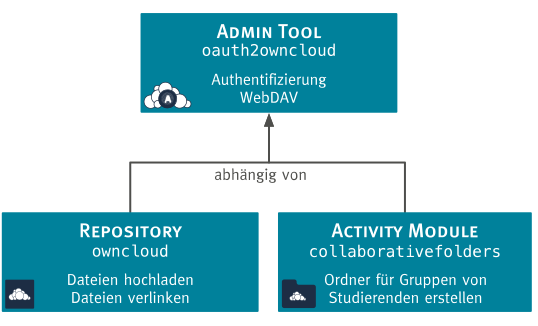

# Software Architektur

In Vorbereitung auf unser Projektseminar haben wir verschiedene bestehende Plugins evaluiert. Hauptsächlich haben wir uns hier an dem [WebDAV](https://docs.moodle.org/32/en/WebDAV_repository) und dem [Dropbox](https://docs.moodle.org/32/en/Dropbox_repository) Plugin orientiert.

Zur Umsetzung des Projektziels, musste Moodle um nötige Funktionalitäten ergänzt werden, die weder durch den [moodle Core](https://github.com/moodle/moodle)
bereitgestellt werden, noch mit Hilfe von externen Plugins hinzugefügt werden konnten. Im Folgenden wird beschrieben,
wie Moodle im Rahmen des Projektes erweitert wurde und welche Auswirkungen sich daraus ergaben.

Moodle stellt verschiedene Typen von Plugins

## Übersicht über die Plugin-Struktur

Moodle [Plugins](https://moodle.org/plugins/) dienen dazu um im Core angebotene Funktionalitäten dahingehend zu erweitern, sodass diese den
individuellen Bedürfnissen des Nutzers entsprechen. Daher eignete sich die Implementierung solcher Plugins ideal zur Umsetzung der definierten Integrationsszenarien.
In Moodle wird ein Plugin einer [Kategorie](https://docs.moodle.org/dev/Plugin_types) zugeordnet, welche eine bestimmte Art von Funktionalität repräsentiert.

Das [Repository Plugin](https://github.com/pssl16/moodle-repository_sciebo) bietet die nötigen Schnittstellen um Dateien aus Sciebo nach Moodle hochzuladen. Um weitere Integrationszenarien zu realisieren, haben wir uns für ein ergänzendes [Activity Module](https://github.com/pssl16/moodle-mod_collaborativefolders)
entschieden. Basierend auf dieser Entscheidung haben wir den [Authentifizierungsprozess](https://github.com/pssl16/moodle-tool_oauth2sciebo) in einem eigenen Plugin implementiert, sodass allen zusätzlichen Plugins der Zugriff auf das Verfahren ermöglicht wird.

| Plugintyp                                                   | Beschreibung                                        | Zweck für das Projekt                                 |
|-------------------------------------------------------------|-----------------------------------------------------|-------------------------------------------------------|
| [`admin tool`](https://docs.moodle.org/dev/Admin_tools) oauth2sciebo| Bietet Dienste zur Site-Administration an           | Verwaltung der Authentifizierung mittels OAuth 2.0    |
| [`repository`](https://docs.moodle.org/dev/Repository_plugins) sciebo| Stellt Verbindung zu einer externen Datenquelle her | Datenbeschaffung aus Sciebo                           |
| [`activity`](https://docs.moodle.org/dev/Activity_modules) collaborativefolders| Stellt Aktivität in einem Kurs zur Verfügung        | Bereitstellung eines Ordners für kollaborative Arbeit |

## Abhängigkeiten

Die aus der Aufteilung der Funktionen in verschiedene Plugins resultierenden Abhängigkeiten werden in folgender Abbildung
dargestellt:

Zu beachten ist, dass eine möglichst hohe Flexibilität und Modularität bei dem Entwurf der Software Architektur erzielt
werden sollte. Das führt zwar mit sich, dass funktionale Plugins (also das `repository` und das `activity` Plugin) nicht
eigenständig ohne das `admin tool` existieren können, allerdings wird weiteren, in Zukunft entwickelten Plugins ebenfalls
Zugriff auf die OAuth 2.0 Schnittstelle in [Sciebo](https://www.sciebo.de/) bzw. [ownCloud](https://owncloud.org/) ermöglicht,
wodurch sich das Projektergebnis zu einer guten Wiederverwendbarkeit qualifiziert.

## Funktionsübersicht

Die in den verschiedenen Plugins angebotenen Funktionalitäten können wie folgt zusammengefasst werden:

* **`Admin Tool`:** [`oauth2sciebo`](admin-tool/)
    * Umfasst sowohl OAuth 2.0, als auch WebDAV Client.
    * Steuert Protokollablauf von OAuth 2.0 und verwaltet alle dazu nötigen Informationen.
    * Stellt das Verbindungsstück von moodle zu Sciebo bzw. ownCloud
* **`Repository`:** [`sciebo`](repository/)
    * Bewerkstelligt die Datenbeschaffung aus Sciebo bzw. ownCloud nach Moodle.
    * Ermöglicht den Upload von Dateien aus einer persönlichen Sciebo Instanz.
    * Ermöglicht die Verlinkung von Dateien aus Sciebo in Moodle.
* **`Activity Module`:** [`collaborative folders`](activity/)
    * Ermöglicht die Erstellung und Freigabe von Ordern in Sciebo für bestimmte Gruppen in Moodle.
