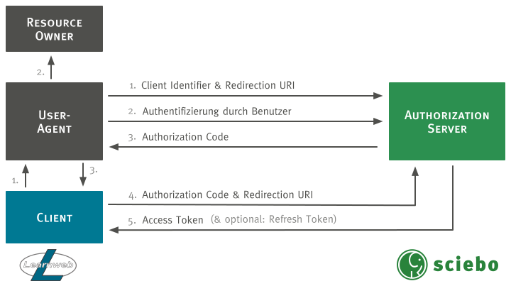

# ownCloud

Um auf Dateien in ownCloud zuzugreifen, wird standardmäßig [eine WebDAV Schnittstelle angeboten](https://doc.owncloud.org/server/latest/user_manual/files/access_webdav.html). Da diese jedoch nur über [Basic Authentication](https://tools.ietf.org/html/rfc7617) ansprechbar ist, musste sie um das [OAuth 2.0 Protokoll](https://oauth.net/2/) erweitert werden.

## Technische Umsetzung

Da man möglichst keine neue Schnittstelle implementieren wollte, war es das Ziel, die bestehende WebDAV Schnittstelle um OAuth 2.0 zu erweitern. Die WebDAV Schnittstelle ist als [ownCloud App](https://doc.owncloud.org/server/latest/developer_manual/app/) realisiert worden und nutzt die [sabre/dav](http://sabre.io/) Bibliothek. Auf der anderen Seite musste das OAuth 2.0 Protokoll mit seinen Schnittstellen bereitgestellt werden, um die Authentifizierung in der WebDAV App um OAuth 2.0 zu erweitern zu können. Dafür wurde eine weitere ownCloud App implementiert.

### Implementierung der `oauth2` App

In der App sollte der häufig für Webapplikationen eingesetzte [Authorization Code Flow](https://tools.ietf.org/html/rfc6749#section-4.1) implementiert werden. Dazu mussten folgende User Stories umgesetzt werden:

* **Clientregistrierung:** Als ownCloud-Administrator möchte ich Clients in den Administrator-Einstellungen hinzufügen und löschen können, um die Kontrolle über erlaubte Clients zu haben.
* **Authorization URL:** Als Client-Entwickler möchte ich eine Authorization URL zur Verfügung haben, um Authorization Codes anfordern zu können.
* **Access Token URL:** Als Client-Entwickler möchte ich eine Access Token URL zur Verfügung haben, um Access Tokens anfordern zu können.
* **Verwaltung autorisierter Applikationen**: Als ownCloud-Nutzer möchte ich in den persönlichen Einstellungen autorisierte Applikationen verwalten können, um einen Überblick zu haben und Autorisierungen widerrufen zu können.

#### Datenmodell

Zunächst musste ein Datenmodell zur Speicherung der benötigten Daten aufgestellt werden. Gemäß dem Authorization Code Flow wurden folgende Entitäten mit Attributen definiert:

* **[`client`](https://tools.ietf.org/html/rfc6749#section-1.1):** Die Applikation, die für den Zugriff auf die WebDAV Schnittstelle autorisiert werden soll.
	* `identifier`: Zeichenkette, die einen Client eindeutig identifiziert.
	* `secret`: Zeichenkette, mit der ein Client sich beim Anfordern eines Access Tokens authentifizieren kann.
	* `redirect_uri`: URI, an die nach erfolgter Autorisierung des Nutzers weitergeleitet wird.
* **[`authorization_code`](https://tools.ietf.org/html/rfc6749#section-1.3.1):** Ein [Authorization Grant](https://tools.ietf.org/html/rfc6749#section-1.3), mit dem der Client die Autorisierung des Nutzers darlegen und somit ein Access Token anfordern kann.
	* `code`: Zeichenkette, die als Authorization Code dient.
	* `client_id`: Client Identifier des Clients, für den der Authorization Code ausgegeben wird.
	* `user_id`: User ID des ownCloud-Nutzers, der den Client autorisiert hat.
	* `expires`: Zeitpunkt, zu dem der Authorization Code ungültig wird (optional).
* **[`access_token`](https://tools.ietf.org/html/rfc6749#section-1.4):** Eine Zeichenkette, die den Zugriff auf die WebDAV Schnittstelle erlaubt.
	* `code`: Zeichenkette, die als Access Token dient.
	* `client_id`: Client Identifier des Clients, für den der Access Token ausgegeben wird.
	* `user_id`: User ID des ownCloud-Nutzers, der den Client autorisiert hat.
	* `expires`: Zeitpunkt, zu dem der Access Token ungültig wird (optional).
* **[`refresh_token`](https://tools.ietf.org/html/rfc6749#section-1.5):** Eine Zeichenkette, mit der ein abgelaufener Access Token gegen einen neuen ausgetauscht werden kann.
	* `code`: Zeichenkette, die als Refresh Token dient.
	* `client_id`: Client Identifier des Clients, für den der Access Token ausgegeben wird.
	* `user_id`: User ID des ownCloud-Nutzers, der den Client autorisiert hat.
	* `expires`: Zeitpunkt, zu dem der Refresh Token ungültig wird (optional).

Folgendes Entity-Relationship-Modell fasst das Datenmodell nochmal grafisch zusammen.

### Anpassung der `dav` App

## Benutzung

### Installation

Da die Änderungen zum aktuellen Zeitpunkt noch nicht in den Core aufgenommen wurden, muss der `dav-oauth`-Branch des [geforkten Repositorys](https://github.com/pssl16/core) geklont werden:

<pre><code class="nohighlight">$ git clone -b dav-oauth https://github.com/pssl16/core</code></pre>

Danach müssen die Dependencies installiert werden. Dazu genügt es, im Verzeichnis des Repositorys folgenden Befehl auszuführen:

<pre><code class="nohighlight">$ make</code></pre>

Die restlichen Installationsschritte unterscheiden sich nicht von denen im [ownCloud Handbuch](https://doc.owncloud.org/server/latest/admin_manual/installation/index.html).

### Clientregistrierung

### Authorization Code Flow
Die nachfolgende Abbildung stellt den durch die `oauth2` App implementierten [OAuth 2.0 Authorization Code Flow](https://tools.ietf.org/html/rfc6749#section-4.1) dar.
 

  <strong>TODO:</strong> Beschreibung der Schritte einfügen.

### Angepasste WebDAV Schnittstelle