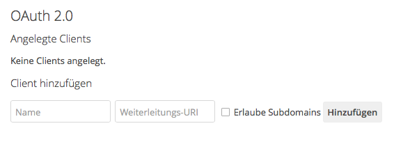
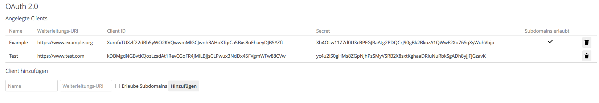
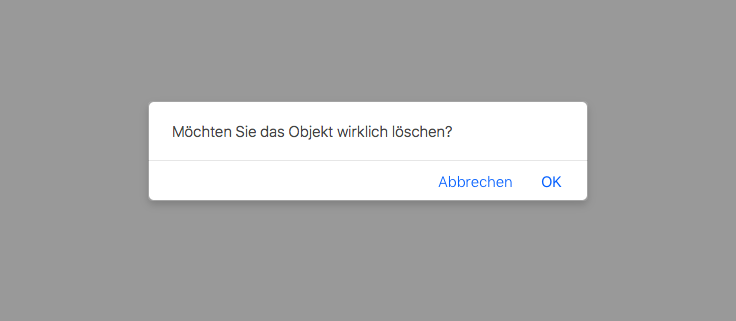

# Benutzung

## Installation

> **Hinweis:** Zur Zeit liegen die Anpassungen der `dav` App als [Pull Request](https://github.com/owncloud/core/pull/26742) vor. Falls die Änderungen angenommen werden, sind sie in einer der nächsten ownCloud Versionen enthalten.

Da die Änderungen zum aktuellen Zeitpunkt noch nicht in den Core aufgenommen wurden, muss der `dav-oauth`-Branch des [geforkten Repositorys](https://github.com/pssl16/core) geklont werden:

```nohighlight
$ git clone -b dav-oauth https://github.com/pssl16/core
```

Danach müssen die Dependencies installiert werden. Dazu genügt es, im Verzeichnis des Repositorys folgenden Befehl auszuführen:

```nohighlight
$ make
```

Die restlichen Installationsschritte unterscheiden sich nicht von denen im [ownCloud Handbuch](https://doc.owncloud.org/server/latest/admin_manual/installation/index.html).

## Clientregistrierung
Zur Clientregistrierung muss in der Eingabemaske der OAuth 2 App in den Adminsettings dem Client ein Name gegeben werden und eine gültige URL als `redirect URI` angegeben werden. 
Mit Betätigung des OK-Buttons wird der Client registriert, erhält eine `ClientID` und ein `Clientsecret` zugewiesen und wird nun in der Tabelle mit den entsprechenden Attributen dargestellt.



**Löschen der Clientregistrierung**
Um eine Clientregistrierung zu löschen muss in den Adminsettings die tabellarische Ansicht der registrierten Clients ausgewählt werden. 
Nun kann man bei dem zu löschenden Client rechts neben den zugeordneten Attributen auf ein Mülleimer-Symbol klicken, um die entsprechende Clientregistrierung zu löschen.
Nachdem auf das Symbol geklickt wurde, erscheint noch eine Sicherheitsabfrage, in der man die Löschung bestätigen muss.

<div class="alert alert-danger">
<strong>TODO:</strong> max width einfügen - wahrscheinlich zusätzlich in css einfügen
</div>





## Authorization Code Flow
Die nachfolgende Abbildung stellt den durch die `oauth2` App implementierten [OAuth 2.0 Authorization Code Flow](https://tools.ietf.org/html/rfc6749#section-4.1) dar.
 


<div class="alert alert-danger">
  <strong>TODO:</strong> Beschreibung der Schritte einfügen.
</div>

## Angepasste WebDAV Schnittstelle

## Widerrufung der Autorisierung
Zur Widerrufung der Autorisierung muss diese in den Einstellungen per Klick auf den entsprechenden Button widerrufen werden. Dies ist für den Nutzer in den persönlichen Einstellungen möglich, durch Klicken des Mülleimer-Symbols rechts neben dem jeweiligen Eintrag.

<div class="alert alert-danger">
<strong>TODO:</strong> Screenshots einfügen.
</div>
