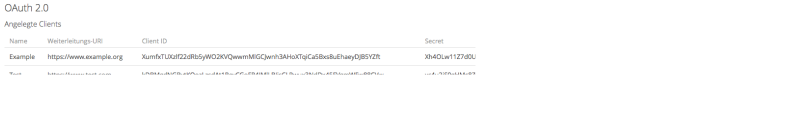
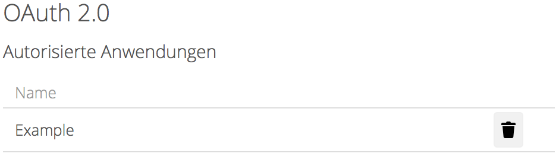

# Benutzung

## Installation

> **Hinweis:** Zur Zeit liegen die Anpassungen der `dav` App als [Pull Request](https://github.com/owncloud/core/pull/26742) vor. Falls die Änderungen angenommen werden, sind sie in einer der nächsten ownCloud Versionen enthalten.

Da die Änderungen zum aktuellen Zeitpunkt noch nicht in den Core aufgenommen wurden, muss der `dav-oauth`-Branch des [geforkten Repositorys](https://github.com/pssl16/core) geklont werden:

```nohighlight
$ git clone -b dav-oauth https://github.com/pssl16/core
```

Danach müssen die Dependencies installiert werden. Dazu genügt es, im Verzeichnis des Repositorys folgenden Befehl auszuführen:

```nohighlight
$ make
```

Die restlichen Installationsschritte unterscheiden sich nicht von denen im [ownCloud Handbuch](https://doc.owncloud.org/server/latest/admin_manual/installation/index.html).

## Clientregistrierung
Zur Clientregistrierung muss in der Eingabemaske der OAuth 2 App in den Adminsettings dem Client ein Name gegeben werden und eine gültige URL als `redirect URI` angegeben werden. 
Mit Betätigung des OK-Buttons wird der Client registriert, erhält eine `ClientID` und ein `Clientsecret` zugewiesen und wird nun in der Tabelle mit den entsprechenden Attributen dargestellt.


**Löschen der Clientregistrierung**
Um eine Clientregistrierung zu löschen muss in den Adminsettings die tabellarische Ansicht der registrierten Clients ausgewählt werden. 
Nun kann man bei dem zu löschenden Client rechts neben den zugeordneten Attributen auf ein Mülleimer-Symbol klicken, um die entsprechende Clientregistrierung zu löschen.
Nachdem auf das Symbol geklickt wurde, erscheint noch eine Sicherheitsabfrage, in der man die Löschung bestätigen muss.

Screenshot zur Darstellung der Clients:



Screenshot zur Sicherheitsabfrage bei Löschung des Clients:


## Authorization Code Flow
Die nachfolgende Abbildung stellt den durch die `oauth2` App implementierten [OAuth 2.0 Authorization Code Flow](https://tools.ietf.org/html/rfc6749#section-4.1) dar.
 

Anmerkung: Die Schritte 1, 2 und 3 sind zweigeteilt, da sie durch den User-Agent laufen.

Der dargestellte Authorization Code Flow beinhaltet die folgenden Schritte:

1. Client Identifier & Redirection URI: Der Client (Learnweb) initiiert den Flow durch die Weiterleitung des User-Agents des Resource Owners
zum Authorization Endpoint. Der Client fügt seinen Client Identifier, das angefragte Scope, Status und eine Redirection URI an, zu welcher der
User-Agent vom Authorization Server (sciebo) zurückgeleitet wird, wenn der Zugriff gestattet, oder abgelehnt wurde.
2. Authentifizierung durch Benutzer: Der Authorization Server authentifiziert den Resource Owner (über den User-Agent) und stellt fest,
ob der Resource Owner die Zugriffsanfrage des Clients zulässt oder ablehnt.
3. Authorization Code: Vorausgesetzt der Resource Owner erlaubt den Zugriff, so leitet der Authorization Server den User-Agent zurück zum Client,
wozu die vorher (in der Anfrage oder während der Clientregistrierung) bereitgestellte Redirection URI genutzt wird. Die 
Redirection URI beinhaltet einen Authorization Code und jeglichen vom Client im Vorhinein bereitgestellten Status.
4. Authorization Code & Redirection URI: Der Client fragt ein Access Token vom Endpunkt des Authorization Servers an, indem
der Authorization Code aus dem vorherigen Schritt angefügt wird. Wenn die Anfrage durchgeführt wird, authentifiziert sich der Client
automatisch mit dem Authorization Server. Der Client fügt die für den Erhalt des Authorization Codes genutzte Redirection URI
zur Verifizierung an.
5. Access Token (& optional: Refresh Token): Der Authorization Server authentifiziert den Client, validiert den Authorization Code, und
prüft, dass die empfangene Redirection URI mit der zur Weiterleitung im dritten Schritt ("Authorization Code") genutzte URI übereinstimmt.
Wenn die Überprüfung erfolgreich verläuft, antwortet der Authorization Server mit einem Access Token und optional mit einem Refresh Token.

## Angepasste WebDAV Schnittstelle

## Widerrufung der Autorisierung
Zur Widerrufung der Autorisierung muss diese in den Einstellungen per Klick auf den entsprechenden Button widerrufen werden. 
Dies ist für den Nutzer in den persönlichen Einstellungen möglich, durch Klicken des Mülleimer-Symbols rechts neben dem jeweiligen Eintrag.
Nachdem auf das Symbol geklickt wurde, erscheint auch hier eine Sicherheitsabfrage, in der man die Löschung bestätigen muss.

Screenshot zur Darstellung der autorisierten Anwendungen:


Screenshot zur Sicherheitsabfrage bei Löschung einer autorisierten Anwendung:


