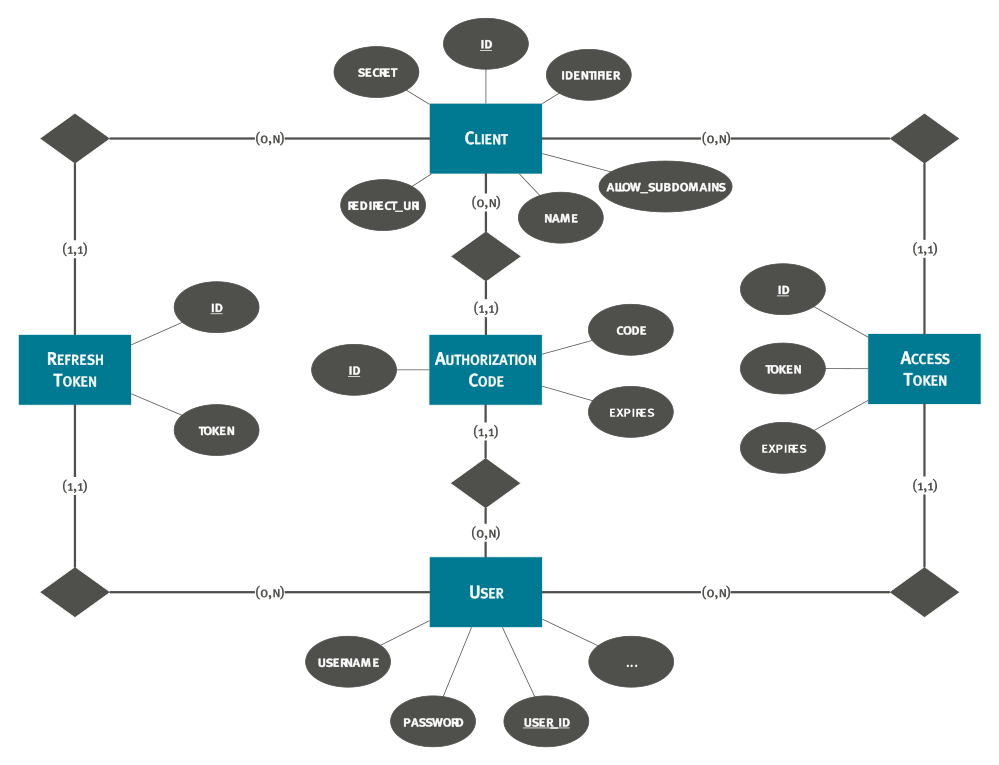
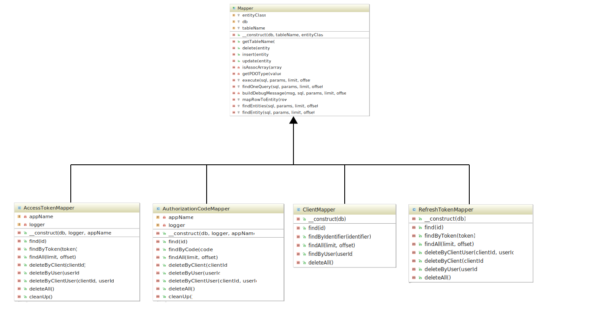
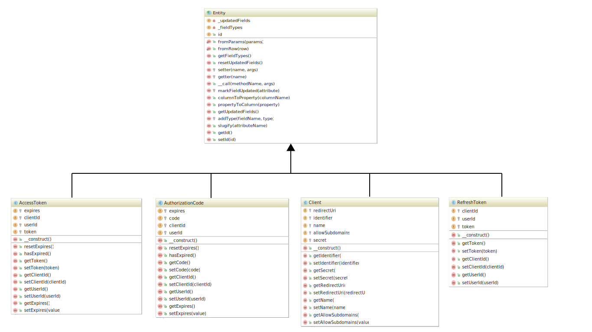

# App: `oauth2`

## Zweck

In der App sollte der häufig für Webapplikationen eingesetzte [Authorization Code Flow](https://tools.ietf.org/html/rfc6749#section-4.1) implementiert werden. Dazu mussten folgende User Stories umgesetzt werden:

* **Clientregistrierung:** Als ownCloud-Administrator möchte ich Clients in den Administrator-Einstellungen hinzufügen und löschen können, um die Kontrolle über erlaubte Clients zu haben.
* **Authorization URL:** Als Client-Entwickler möchte ich eine Authorization URL zur Verfügung haben, um Authorization Codes anfordern zu können.
* **Access Token URL:** Als Client-Entwickler möchte ich eine Access Token URL zur Verfügung haben, um Access Tokens anfordern zu können.
* **Verwaltung autorisierter Applikationen**: Als ownCloud-Nutzer möchte ich in den persönlichen Einstellungen autorisierte Applikationen verwalten können, um einen Überblick zu haben und Autorisierungen widerrufen zu können.

## Datenmodell

Zunächst musste ein Datenmodell zur Speicherung der benötigten Daten aufgestellt werden. Gemäß dem Authorization Code Flow wurden folgende Entitäten mit Attributen definiert:

* **[`client`](https://tools.ietf.org/html/rfc6749#section-1.1):** Die Applikation, die für den Zugriff auf die WebDAV Schnittstelle autorisiert werden soll.
	* `identifier`: Zeichenkette, die einen Client eindeutig identifiziert.
	* `secret`: Zeichenkette, mit der ein Client sich beim Anfordern eines Access Tokens authentifizieren kann.
	* `redirect_uri`: URI, an die nach erfolgter Autorisierung des Nutzers weitergeleitet wird.
* **[`authorization_code`](https://tools.ietf.org/html/rfc6749#section-1.3.1):** Ein [Authorization Grant](https://tools.ietf.org/html/rfc6749#section-1.3), 
mit dem der Client die Autorisierung des Nutzers darlegen und somit ein Access Token anfordern kann.
	* `code`: Zeichenkette, die als Authorization Code dient.
	* `client_id`: Client Identifier des Clients, für den der Authorization Code ausgegeben wird.
	* `user_id`: User ID des ownCloud-Nutzers, der den Client autorisiert hat.
	* `expires`: Zeitpunkt, zu dem der Authorization Code ungültig wird (optional).
* **[`access_token`](https://tools.ietf.org/html/rfc6749#section-1.4):** Eine Zeichenkette, die den Zugriff auf die WebDAV Schnittstelle erlaubt.
	* `code`: Zeichenkette, die als Access Token dient.
	* `client_id`: Client Identifier des Clients, für den der Access Token ausgegeben wird.
	* `user_id`: User ID des ownCloud-Nutzers, der den Client autorisiert hat.
	* `expires`: Zeitpunkt, zu dem der Access Token ungültig wird (optional).
* **[`refresh_token`](https://tools.ietf.org/html/rfc6749#section-1.5):** Eine Zeichenkette, mit der ein abgelaufener Access Token gegen einen neuen ausgetauscht werden kann.
	* `code`: Zeichenkette, die als Refresh Token dient.
	* `client_id`: Client Identifier des Clients, für den der Access Token ausgegeben wird.
	* `user_id`: User ID des ownCloud-Nutzers, der den Client autorisiert hat.
	* `expires`: Zeitpunkt, zu dem der Refresh Token ungültig wird (optional).

Folgendes Entity-Relationship-Modell fasst das Datenmodell nochmal grafisch zusammen.



<div class="alert alert-danger">
  <strong>TODO:</strong> Datenmodell updaten.
</div>

## Vorgegebene Schnittstelle

<div class="alert alert-danger">
  <strong>TODO:</strong> Die durch ownCloud Apps vorgegebene Schnittstelle beschreiben.
</div>

## Implementierung

### Mapper und Entities

Für den Datenbank-Zugriff im PHP-Code ist es in ownCloud möglich, [Mapper](https://doc.owncloud.org/server/latest/developer_manual/app/database.html#mappers) und 
[Entities](https://doc.owncloud.org/server/latest/developer_manual/app/database.html#entities) zu schreiben. 
Dadurch werden Tupel in einer Datenbank-Tabelle automatisch in ein Objekt umgewandelt.

Folgendes Codebeispiel zeigt am Beispiel des Entitys `Client`, wie eine PHP-Klasse dazu aussehen muss.

```php
<?php
namespace OCA\OAuth2\Db;

use OCP\AppFramework\Db\Entity;

/**
 * Class Client
 *
 * @method string getIdentifier()
 * @method void setIdentifier(string $identifier)
 * @method string getSecret()
 * @method void setSecret(string $secret)
 * @method string getRedirectUri()
 * @method void setRedirectUri(string $redirectUri)
 * @method string getName()
 * @method void setName(string $name)
 */
class Client extends Entity {

    protected $identifier;
    protected $secret;
    protected $redirectUri;
    protected $name;

    public function __construct() {
        $this->addType('id', 'int');
        $this->addType('identifier', 'string');
        $this->addType('secret', 'string');
        $this->addType('redirect_uri', 'string');
        $this->addType('name', 'string');
    }

}
```

Wichtig ist, dass die Klasse von [`Entity`](https://doc.owncloud.org/api/classes/OCP.AppFramework.Db.Entity.html) erbt und sowohl der Klassenname als auch die Attribute mit denen der Tabelle übereinstimmen. 
Pascal bzw. Camel case im PHP-Code wird automatisch zu Snake case für die Datenbank umgewandelt. 
Getter und Setter werden ebenfalls automatisch generiert. Die PHPDoc Kommentare dienen lediglich dazu, in der Entwicklungsumgebung eine automatische Vervollständigung zu haben. 
Die Angabe von [Typen](https://doc.owncloud.org/server/latest/developer_manual/app/database.html#types) im Konstruktor dienen dazu, beim Lesen aus der Datenbank die richtige Umwandlung zu erhalten.

Das folgende Codebeispiel zeigt einen Ausschnitt aus dem zur `Client` Entity gehörenden Mapper.

```php
<?php
namespace OCA\OAuth2\Db;

use InvalidArgumentException;
use OCP\AppFramework\Db\Entity;
use OCP\IDb;
use OCP\AppFramework\Db\Mapper;

class ClientMapper extends Mapper {

	/**
	 * ClientMapper constructor.
	 *
	 * @param IDb $db Database Connection.
	 */
	public function __construct(IDb $db) {
		parent::__construct($db, 'oauth2_clients');
	}

	/**
	 * Selects a client by its ID.
	 *
	 * @param int $id The client's ID.
	 *
	 * @return Entity The client entity.
	 *
	 * @throws \OCP\AppFramework\Db\DoesNotExistException if not found.
	 * @throws \OCP\AppFramework\Db\MultipleObjectsReturnedException if more than one result.
	 */
	public function find($id) {
		if (!is_int($id)) {
			throw new InvalidArgumentException('id must not be null');
		}

		$sql = 'SELECT * FROM `' . $this->tableName . '` WHERE `id` = ?';
		return $this->findEntity($sql, array($id), null, null);
	}

	/**
	 * Selects clients by the given user ID.
	 *
	 * @param string $userId The user ID.
	 *
	 * @return array The client entities.
	 */
	public function findByUser($userId) {
		if (!is_string($userId)) {
			throw new InvalidArgumentException('userId must not be null');
		}

		$sql = 'SELECT * FROM `' . $this->tableName . '` '
			. 'WHERE `id` IN ( '
				. 'SELECT `client_id` FROM `oc_oauth2_authorization_codes` WHERE `user_id` = ? '
				. 'UNION '
				. 'SELECT `client_id` FROM `oc_oauth2_access_tokens` WHERE `user_id` = ? '
			.')';
		return $this->findEntities($sql, array($userId, $userId), null, null);
	}

}
```

Beim Mapper ist es wichtig, dass die Klasse von [`Mapper`](https://doc.owncloud.org/api/classes/OCP.AppFramework.Db.Mapper.html) erbt und eine Entity-Klasse zu ihm existiert. 
Dazu wird das Wort vor „Mapper“ als Entityname verwendet. Im Konstruktur wird der Tabellenname angegeben. 
Die beiden Funktionen `find` und `findByUser` demonstrieren `SELECT`-Anweisungen. 
Dazu wird die SQL-Anweisungen zusammen mit benötigten Parametern an `findEntity` bzw. `findEntities` übergeben, abhängig davon, ob mehrere Entities im Ergebnis enthalten sein sollten. 
Funktionen zum löschen, einfügen und updaten werden von der Oberklasse bereits implementiert und mussten nicht angepasst werden.

### Schnittstellen und Routes

Um in einer ownCloud App Schnittstellen anzubieten, müssen [Routes](https://doc.owncloud.org/server/latest/developer_manual/app/routes.html) registriert werden. 
Zur Umsetzung der erwähnten User Stories waren folgende Routes notwendig:

| Methode | Endpunkt              | Beschreibung                                                                                              |
|---------|-----------------------|-----------------------------------------------------------------------------------------------------------|
| `GET`   | `authorize`           | Endpunkt, zu dem der Client den Nutzer weiterleitet, um die Autorisierung anzufragen (Authorization URL). |
| `POST`  | `authorize`           | Endpunkt, der aufgerufen wird, sobald der Nutzer den Client autorisiert hat.                              |
| `POST`  | `api/v1/token`        | Endpunkt, an dem ein Access Token angefordert wird (Access Token URL).                                    |
| `POST`  | `clients`             | Endpunkt, durch den der Administrator einen Client hinzufügen kann.                                       |
| `POST`  | `clients/{id}/delete` | Endpunkt, durch den der Administrator den Client mit der ID `id` löschen kann.                            |
| `POST`  | `clients/{id}/revoke` | Endpunkt, durch den der Nutzer die Autorisierung des Clients mit der ID `id` widerrufen kann.             |

Registriert werden die Routes in der Datei `routes.php`, indem ein Array mit den Routes zurückgegeben wird. Nachfolgendes Codebeispiel zeigt einige der obigen Routes:

```php
<?php
return [
	'routes' => [
		['name' => 'page#authorize', 'url' => '/authorize', 'verb' => 'GET'],
		['name' => 'o_auth_api#generate_token', 'url' => '/api/v1/token', 'verb' => 'POST'],
		['name' => 'settings#deleteClient', 'url' => '/clients/{id}/delete', 'verb' => 'POST']
    ]
];

```

Durch `name` wird für jede Route der Name des dazugehörigen [Controllers](#controller) sowie die aufzurufende Funktion angegeben. 
Vor dem `#`-Zeichen steht der Controllername in Snake case und hinter dem `#`-Zeichen steht der Funktionsname (ebenfalls in Snake case). 
Mithilfe von `url` wird der Endpunkt festgelegt und `verb` definiert die HTTP-Methode.

### Controller

Wenn an einem Endpunkt eine HTTP-Anfrage ankommt, so wird der in den Routes definierte [Controller](https://doc.owncloud.org/server/latest/developer_manual/app/controllers.html) aufgerufen. 
Wichtig ist hierbei, dass von der Klasse [`Controller`](https://doc.owncloud.org/api/classes/OCP.AppFramework.Controller.html) oder 
einer Unterklasse wie [`ApiController`](https://doc.owncloud.org/api/classes/OCP.AppFramework.ApiController.html) geerbt wird.

Für den Controller notwendige Parameter wie [Mapper](#mapper-und-entities) können im Konstruktor als Parameter angegeben und so durch 
[Dependency Injection](https://doc.owncloud.org/server/latest/developer_manual/app/container.html) erhalten werden. 
Nachfolgendes Codebeispiel zeigt den Konstruktor vom `PageController`.

```php
/**
 * PageController constructor.
 * 
 * @param string $AppName The name of the app.
 * @param IRequest $request The request.
 * @param ClientMapper $clientMapper The client mapper.
 * @param AuthorizationCodeMapper $authorizationCodeMapper The authorization code mapper.
 * @param string $UserId The user ID.
 */
public function __construct($AppName, IRequest $request, ClientMapper $clientMapper,
	AuthorizationCodeMapper $authorizationCodeMapper, $UserId) {
	parent::__construct($AppName, $request);

	$this->clientMapper = $clientMapper;
	$this->authorizationCodeMapper = $authorizationCodeMapper;
	$this->userId = $UserId;
}
```

Die hier notwendigen Parameter sind der Name der App, eine `ClientMapper` Instanz, eine `AuthorizationCodeMapper` Instanz und die ID des Nutzers, 
um bei der Autorisierung des Clients speichern zu können, welcher Nutzers dies veranlasst hat.

Die mit den Routes verknüpften Funktionen können zur Zugriffskontrolle mit [PHPDoc Annotationen](https://doc.owncloud.org/server/latest/developer_manual/app/controllers.html#authentication) 
versehen werden. Folgendes Codebeispiel zeigt die Annotationen für die Funktion `generateToken` im `OAuthApiController`.

```php
/**
 * Implements the OAuth 2.0 Access Token Response.
 *
 * @param string $code The authorization code.
 * @return JSONResponse The Access Token or an empty JSON Object.
 *
 * @NoAdminRequired
 * @NoCSRFRequired
 * @PublicPage
 * @CORS
 */
public function generateToken($code) { }
```

Die Annotationen haben dabei folgende Bedeutungen.

| Annotation         | Bedeutung                                                         |
|--------------------|-------------------------------------------------------------------|
| `@NoAdminRequired` | Aufruf auch von normalen Nutzern möglich.                         |
| `@NoCSRFRequired`  | Zeigt an, dass die Überprüfung des CSRF Tokens nicht gewollt ist. |
| `@PublicPage`      | Zugriff auch ohne Login möglich.                                  |
| `@CORS`            | Aufruf der API durch andere Web Applikationen von außen möglich.  |


In den Controller-Funktionen können verschiedene Inhalte zurückgegeben werden. Hier genutzte Rückgabetypen sind in der folgenden Tabelle zusammengefasst.

| Typ                                                                                                          | Beschreibung                                                        |
|--------------------------------------------------------------------------------------------------------------|---------------------------------------------------------------------|
| [`TemplateResponse`](https://doc.owncloud.org/server/latest/developer_manual/app/controllers.html#templates) | Zur Rückgabe eines Templates, das dem Nutzer angezeigt werden soll. |
| [`RedirectResponse`](https://doc.owncloud.org/server/latest/developer_manual/app/controllers.html#redirects) | Zur Weiterleitung des Nutzers an eine andere URL.                   |
| [`JSONResponse`](https://doc.owncloud.org/server/latest/developer_manual/app/controllers.html#json)          | Zur Rückgabe eines JSON Strings.                                    |

Ein Beispiel für die Rückgabetypen `TemplateResponse` und `RedirectResponse` gibt die Funktion `authorize` im `PageController`, die im folgenden Codebeispiel zu sehen ist.

```php
/**
 * Shows a view for the user to authorize a client.
 *
 * @param string $response_type The expected response type.
 * @param string $client_id The client identifier.
 * @param string $redirect_uri The redirect URI.
 * @param string $state The state.
 * @param string $scope The scope.
 *
 * @return TemplateResponse|RedirectResponse The authorize view or a
 * redirection to the ownCloud main page.
 *
 * @NoAdminRequired
 * @NoCSRFRequired
 */
public function authorize($response_type, $client_id, $redirect_uri, $state = null, $scope = null) {
	if (!is_string($response_type) || !is_string($client_id)
		|| !is_string($redirect_uri) || (isset($state) && !is_string($state))
		|| (isset($scope) && !is_string($scope))) {
		return new RedirectResponse(OC_Util::getDefaultPageUrl());
	}

	try {
		/** @var Client $client */
		$client = $this->clientMapper->findByIdentifier($client_id);
	} catch (DoesNotExistException $exception) {
		return new RedirectResponse(OC_Util::getDefaultPageUrl());
	}

	if (strcmp($client->getRedirectUri(), urldecode($redirect_uri)) !== 0) {
		return new RedirectResponse(OC_Util::getDefaultPageUrl());
	}
	if (strcmp($response_type, 'code') !== 0) {
		return new RedirectResponse(OC_Util::getDefaultPageUrl());
	}

	return new TemplateResponse('oauth2', 'authorize', ['client_name' => $client->getName()]);
}
```

Hier werden zunächst die Parameter auf Gültigkeit überprüft. Sollten die Parameter nicht gültig sein (beispielsweise deshalb, 
weil der angegebene Client nicht existiert oder dessen Redirect URI falsch angegeben wurde) wird mit einem `RedirectResponse` auf die ownCloud Startseite umgeleitet. 
Andernfalls wird ein `TemplateResponse` für das Template `authorize` zurückgegeben. 
Für das Rendern des Templates können Parameter wie hier `client_name` für den Namen des Clients übergeben werden.

Der Rückgabetyp `JSONResponse` wird für die Rückgabe des Access Tokens in der Funktion `generateToken` im `OAuthApiController` genutzt, 
wie nachfolgendes Codebeispiel zeigt. Zudem ist das Zusammenspiel mit Entities und Mappern zu sehen.

```php
/**
 * Implements the OAuth 2.0 Access Token Response.
 *
 * @param string $code The authorization code.
 * @return JSONResponse The Access Token or an empty JSON Object.
 *
 * @NoAdminRequired
 * @NoCSRFRequired
 * @PublicPage
 * @CORS
 */
public function generateToken($code) {
	if (is_null($code) || is_null($_SERVER['PHP_AUTH_USER'])
		|| is_null($_SERVER['PHP_AUTH_PW'])) {
		return new JSONResponse(['message' => 'Missing credentials.'], Http::STATUS_BAD_REQUEST);
	}

	try {
		/** @var Client $client */
		$client = $this->clientMapper->findByIdentifier($_SERVER['PHP_AUTH_USER']);
	} catch (DoesNotExistException $exception) {
		return new JSONResponse(['message' => 'Unknown credentials.'], Http::STATUS_BAD_REQUEST);
	}

    if (strcmp($client->getSecret(), $_SERVER['PHP_AUTH_PW']) !== 0) {
        return new JSONResponse(['message' => 'Unknown credentials.'], Http::STATUS_BAD_REQUEST);
    }

	try {
		/** @var AuthorizationCode $authorizationCode */
		$authorizationCode = $this->authorizationCodeMapper->findByCode($code);
	} catch (DoesNotExistException $exception) {
		return new JSONResponse(['message' => 'Unknown credentials.'], Http::STATUS_BAD_REQUEST);
	}

    if (strcmp($authorizationCode->getClientId(), $client->getId()) !== 0) {
        return new JSONResponse(['message' => 'Unknown credentials.'], Http::STATUS_BAD_REQUEST);
    }

	$token = Utilities::generateRandom();
	$userId = $authorizationCode->getUserId();
	$accessToken = new AccessToken();
	$accessToken->setToken($token);
	$accessToken->setClientId($authorizationCode->getClientId());
	$accessToken->setUserId($userId);
	$this->accessTokenMapper->insert($accessToken);

    $this->authorizationCodeMapper->delete($authorizationCode);

    return new JSONResponse(
        [
            'access_token' => $token,
            'token_type' => 'Bearer',
			'user_id' => $userId
        ]
    );
}
```

Nach erfolgreicher Überprüfung des Authorization Codes und der Angaben zur Client Authentication im Authorization Header wird eine neuer Access Token erstellt und in der Datenbank gespeichert. 
Der verwendete Authorization Code wird zudem gelöscht. Im JSON Response wird dann der Access Token, der Token Typ und die ID des Nutzers zurückgegeben. 
Nachfolgend ist ein Beispiel dazu angegeben.

```json
{
	"access_token" : "1vtnuo1NkIsbndAjVnhl7y0wJha59JyaAiFIVQDvcBY2uvKmj5EPBEhss0pauzdQ",
	"token_type" : "Bearer",
	"user_id" : "admin"
}
```

Für die Token-Generierung wurde die Hilfsklasse `Utilities` mit der statischen Funktion `generateRandom` geschrieben, 
die mithilfe einer ownCloud-internen Funktion 64-stellige Zeichenketten erzeugt. 
Folgendes Codebeispiel zeigt diese Klasse.

```php
<?php
namespace OCA\OAuth2;

class Utilities {

    /**
     * Generates a random string with 64 characters.
     *
     * @return string The random string.
     */
    public static function generateRandom() {
        return \OC::$server->getSecureRandom()->generate(64,
            'ABCDEFGHIJKLMNOPQRSTUVWXYZabcdefghijklmnopqrstuvwxyz0123456789');
    }

}
```

Zusammenfassend werden im folgenden UML-Klassendiagramm die Controller mit ihren Beziehungen zu den Entities und Mappern dargestellt.

<div class="alert alert-danger">
  <strong>TODO:</strong> Klassendiagramme zusammenfügen bzw. vervollständigen.
</div>






### Templates

In den [Templates](https://doc.owncloud.org/server/9.0/developer_manual/app/templates.html) einer ownCloud App wird die für den Nutzer sichtbare Oberfläche definiert. 
Es können die vom [Controller](#controller) übergebenen Parameter genutzt werden. Dazu gibt es ein Array mit dem Namen `$_`. 
Zur Vermeidung von Cross-Site-Scripting gibt es die ownCloud-interne Funktion `p()`, mithilfe derer Werte ausgegeben werden können.

Folgende Templates wurden in der App definiert:

* **`authorize`**: Zur Darstellung des Authroization Requests, bei dem der Nutzer um Autorisierung eines Clients gebeten wird. 
Es werden ein Text zur Erklärung sowie Buttons zum Akzeptieren oder Ablehnen angezeigt.
* **`settings-admin`**: Stellt zur Verwaltung der Clients eine tabellarische Auflistung der Clients sowie ein Formular zum Hinzufügen von Clients dar.
* **`settings-personal`**: Stellt eine tabellarische Auflistung der vom Nutzer autorisierten Clients dar, mit der Möglichkeit, die Autorisierung zu widerrufen.

Folgendes Codebeispiel zeigt das Template `settings-admin`.

```php
<?php
<div class="section" id="oauth2">
    <h2><?php p($l->t('OAuth 2.0')); ?></h2>

    <h3><?php p($l->t('Registered clients')); ?></h3>
    <?php if (empty($_['clients'])) {
        p($l->t('No clients registered.'));
    }
    else { ?>
    <table class="grid">
        <thead>
        <tr>
            <th id="headerName" scope="col"><?php p($l->t('Name')); ?></th>
            <th id="headerRedirectUri" scope="col"><?php p($l->t('Redirect URI')); ?></th>
            <th id="headerClientIdentifier" scope="col"><?php p($l->t('Client Identifier')); ?></th>
            <th id="headerSecret" scope="col"><?php p($l->t('Secret')); ?></th>
            <th id="headerRemove">&nbsp;</th>
        </tr>
        </thead>
        <tbody>
            <?php foreach ($_['clients'] as $client) { ?>
                <tr>
                    <td><?php p($client->getName()); ?></td>
                    <td><?php p($client->getRedirectUri()); ?></td>
                    <td><?php p($client->getIdentifier()); ?></td>
                    <td><?php p($client->getSecret()); ?></td>
                    <td>
                        <form action="../apps/oauth2/clients/<?php p($client->getId()); ?>/delete" method="post"
                              style='display:inline;'>
                            <input type="submit" class="button icon-delete" value="">
                        </form>
                    </td>
                </tr>
            <?php } ?>
        </tbody>
    </table>
    <?php } ?>

    <h3><?php p($l->t('Add client')); ?></h3>
    <form action="../apps/oauth2/clients" method="post">
        <input id="name" name="name" type="text" placeholder="<?php p($l->t('Name')); ?>">
        <input id="redirect_uri" name="redirect_uri" type="url" placeholder="<?php p($l->t('Redirect URI')); ?>">
        <input type="submit" class="button" value="<?php p($l->t('Add')); ?>">
    </form>
</div>
```

In diesem Template wird eine Tabelle mit den registrierten Clients angezeigt. Durch eine `for`-Schleife wird für jeden Client aus dem Parameter `clients` ein Tabelleneintrag angezeigt. 
Sollten noch keine Clients registriert worden sein, sorgt die `if`-Anweisung dafür, dass die Meldung „No clients registered“ angezeigt wird. 
Durch Nutzung von `$l->t()` können die Strings auch [in andere Sprachen Übersetzt werden](https://doc.owncloud.org/server/latest/developer_manual/app/l10n.html#templates).

<div class="alert alert-danger">
  <strong>TODO:</strong> Auf die Integration mit Transifex als Übersetzungsplattform eingehen.
</div>

Des Weiteren gibt es unter der Tabelle ein Formular für das Hinzufügen von Clients. Die in dem Formular angegebene Aktion löst die Funktion `addClient` im `SettingsController` aus. 
Analog dazu gibt es für jeden Tabelleneintrag ein Formular zum Löschen des Eintrags, das die Funktion `deleteClient` im `SettingsController` auslöst.

<div class="alert alert-danger">
  <strong>TODO:</strong> Einbindung eigener CSS und JavaScript Dateien erwähnen.
</div>

### Hooks

Wenn ein Nutzer gelöscht wird, sollen dementsprechend auch alle seine Daten gelöscht werden, wozu auch jegliche Art von 
Authorization Codes und Tokens aus dem OAuth 2.0 Protokollablauf gehören. Hooks müssen also implementiert werden, um die 
Säuberung von Datenbankeinträgen durchzuführen. 

In den [Hooks](https://doc.owncloud.org/server/latest/developer_manual/app/hooks.html?highlight=hook) einer ownCloud App wird Code gespeichert, 
der vor oder nach einem bestimmten Ereignis ausgeführt werden soll. 
Diese Hooks sind teilweise vorgefertig, können aber auch für bestimmte Funktionalitäten selbst entworfen werden. 
Diese Hooks müssen in den `routes` registriert werden und die zugehörige Logik im `Container` gespeichert werden.

In der App wurden Userhooks definiert, welche vor dem endgültigen Löschen eines Nutzers Code ausführen. 
Zuerst wird eine Konstruktorfunktion aufgerufen, welche den `userManager`, den `authorizationCodeMapper`, den `accessTokenMapper` und den `refreshTokenMapper` aufruft. 
Dann wird der pre-delete Hook registriert und ein `callback` für den Hook definiert. 
Dieser `callback` löscht jegliche, dem Nutzer zugehörige, `authorizationCodes`, `accessTokens` und `refreshTokens`. 
Dazu wird in den jeweiligen Konstruktoren die Methode `deleteByUID` aufgerufen.

Folgendes Codebeispiel zeigt den genannten Fall der **`UserHooks`**.

```php
class UserHooks {

	/**
	 * UserHooks constructor.
	 *
	 * @param IUserManager $userManager The user manager
	 * @param AuthorizationCodeMapper $authorizationCodeMapper The authorization code mapper
	 * @param AccessTokenMapper $accessTokenMapper The access token mapper
	 * @param RefreshTokenMapper $refreshTokenMapper The refresh token mapper
	 */
	public function __construct(IUserManager $userManager,
								AuthorizationCodeMapper $authorizationCodeMapper,
								AccessTokenMapper $accessTokenMapper,
								RefreshTokenMapper $refreshTokenMapper) {
		$this->userManager = $userManager;
		$this->authorizationCodeMapper = $authorizationCodeMapper;
		$this->accessTokenMapper = $accessTokenMapper;
		$this->refreshTokenMapper = $refreshTokenMapper;
	}
	/**
	 * Registers a pre-delete hook for users to delete authorization codes,
	 * access tokens and refresh tokens that reference the user.
	 */
	public function register() {
		/**
		 * @param User $user
		 */
		$callback = function ($user) {
			if (!is_null($user->getUID())) {
				$this->authorizationCodeMapper->deleteByUser($user->getUID());
				$this->accessTokenMapper->deleteByUser($user->getUID());
				$this->refreshTokenMapper->deleteByUser($user->getUID());
			}
		};
		$this->userManager->listen('\OC\User', 'preDelete', $callback);
	}
}
```

### Background Job

<div class="alert alert-danger">
  <strong>TODO:</strong> Background Job, der abgelaufene Authorization Codes und Access Tokens löscht, beschreiben.
</div>

### Logging

<div class="alert alert-danger">
  <strong>TODO:</strong> Logging beschreiben.
</div>

### Authentifizierungslogik

Nach der Implementierung des OAuth 2.0 Protokolls musste die Authentifizierung von WebDAV und von ownCloud APIs (für die Nutzung der OCS Share API) Erweitert werden. Diese Erweiterung basiert auf den durchgeführten [Core Anpassungen](core-anpassungen).

Zunächst schauten wir uns die Umsetzung der bestehenden Basic Authentication in der `dav` App an. Dabei stellten wir fest, dass sabre den [Austausch des Authentifizierungsmechanismus](http://sabre.io/dav/authentication/) durch Implementierung eines Interfaces bietet. Für unser Szenario war das Interface `AbstractBearer` relevant, da die Access Tokens aus dem Authorization Code Flow des OAuth 2.0 Protokolls für Bearer Authentication genutzt werden. Dazu mussten wir die Funktion `validateBearerToken` implementieren. Die Logik und das Session-Management lehnen sich stark an die bestehende Implementierung der Basic Authentication an. Für die Authentifizierung einer Anfrage wird hier jedoch auf `AuthModule`s zurückgegriffen.

Ein `AuthModule` kann von ownCloud Apps implementiert und registriert werden. Es wird auch bei der Authentifizierung von API Zugriffen eingesetzt. Eine App muss dazu die Funktionen `auth` und `getUserPassword` implementieren. Erstere authentifiziert eine Anfrage, während letztere das Passwort des Nutzers zu einer Anfrage ermittelt. Da die App `encryption` in bestimmten Nutzungsszenarien auf das Passwort des Nutzers angewiesen ist, existiert die Funktion `getUserPassword`. Sie gibt jedoch in unserer Implementierung eine leere Zeichenkette zurück, da wir an keiner Stelle mit Passwörtern umgehen (siehe [Einschränkungen](#einschrankungen)). `getUserPassword` gibt bei erfolgreicher Authentifizierung ein `User`-Objekt zurück, wie in folgendem Codebeispiel zu sehen ist. Nach Extraktion des Bearer Tokens aus den Authorization Header, wird durch Rückgriff auf den `AccessTokenMapper` die `user_id` ermittelt. Mithilfe des ownCloud-internen `UserManagers` kann daraufhin das `User`-Objekt abgefragt werden.

```php
/**
 * Authenticates a request.
 *
 * @param IRequest $request The request.
 *
 * @return null|IUser The user if the request is authenticated, null otherwise.
 */
public function auth(IRequest $request) {
	$authHeader = $request->getHeader('Authorization');
	if (strpos($authHeader, 'Bearer ') === false) {
		return null;
	} else {
		$bearerToken = substr($authHeader, 7);
	}
	$app = new Application();
	$container = $app->getContainer();
	/** @var AccessTokenMapper $accessTokenMapper */
	$accessTokenMapper = $container->query('OCA\OAuth2\Db\AccessTokenMapper');
	try {
		/** @var AccessToken $accessToken */
		$accessToken = $accessTokenMapper->findByToken($bearerToken);
		if ($accessToken->hasExpired()) {
			return null;
		}
	} catch (DoesNotExistException $exception) {
		return null;
	}
	/** @var IUserManager $userManager */
	$userManager = $container->query('UserManager');
	$user = $userManager->get($accessToken->getUserId());
	return $user;
}
``` 

Zur Registrierung eines `AuthModules` muss dessen Namespace in der [`info.xml`](https://doc.owncloud.org/server/9.1/developer_manual/app/info.html) angegeben werden, wie im folgenden Codebeispiel gezeigt wird:

```xml
<auth-modules>
  <module>OCA\OAuth2\AuthModule</module>
</auth-modules>
```

<div class="alert alert-danger">
  <strong>TODO:</strong> Registrierung für WebDAV beschreiben (<code>types</code> in <code>info.xml</code> und durch Event Listener).
</div>

WebDAV wurde in einer [ownCloud App](https://doc.owncloud.org/server/9.1/developer_manual/app/) namens `dav` mit Unterstützung der Bibliothek [sabre/dav](http://sabre.io/) implementiert. Bei der Untersuchung des bestehenden Authentifizierungsmechanismus stellten wir fest,

## Protokollablauf

Der Protokollablauf der oauth2 App ist dem regulären OAuth2 Protokollablauf nachempfunden. 

Zunächst wird vom Moodle Plugin die Methode `GET authorize` mit den Parametern `response_type`, `client_id` und `redirect_uri` ausgeführt, welche die OAuth 2.0 App anspricht und für eine Weiterleitung an ownCloud sorgt. 
Dann wird von ownCloud eine Authentifizierung erfragt, sprich der reguläre Anmeldebildschirm wird gezeigt, oder die Weiterleitung erfolgt sofort zur Autorisierungsabfrage der OAuth 2.0 App. 
Nach erfolgter Autorisierung wird zur `redirectURI` aus der `GET authorize` Methode weitergeleitet, sprich zurück zum Moodle Plugin. 

Anschließend führt das Moodle Plugin die Methode `POST /api/v1/token` aus, die den Authorizationcode an die OAuth 2.0 App sendet und als Antwort einen Access Token erhält.

Nach erfolgter Autorisierung von Moodle mit ownCloud via OAuth 2.0 kann nun der WebDAV Zugriff folgen. Dieser erfolgt mit dem Access Code auf die OAuth WebDAV App. 
Diese kommuniziert daraufhin mit der OAuth 2.0 App über die Methode `GET api/v1/validate` und dem Access Token und prüft diesen. 
Bei erfolgreicher Überprüfung wird dann der WebDAV Zugriff entsprechend ermöglicht.

div class="alert alert-danger">
  <strong>TODO:</strong> An endgültigen Ablauf anpassen.
</div>


## Tests und Continuous Integration

Zum Testen der PHP-Klassen wurde das Framework [PHPUnit](https://phpunit.de/) verwendet. Die aktuelle Testabdeckung ist bei Codecov einsehbar: [](https://codecov.io/gh/owncloud/oauth2).

Als Continuous Integration Tool wurde Travis CI verwendet. Bei jeder Änderung im [GitHub Repository](https://github.com/owncloud/oauth2) wird ein Build angestoßen, in dem die App mithilfe eines Makefiles für den App Store gebaut wird und anschließend in verschiedenen Umgebungen installiert und getestet wird. Folgende Parameter werden variiert:

* **PHP Versionen**: 5.6, 7.0, 7.1, nightly
* **Datenbanken**: PostgreSQL, MySQL, SQLite
* **Branches des ownCloud Core**: `master`

Der aktuelle Build-Status ist bei Travis einsehbar: [](https://travis-ci.org/owncloud/oauth2).

## Einschränkungen

<div class="alert alert-danger">
  <strong>TODO:</strong> Einschränkungen mit der <code>encryption</code> App beschreiben.
</div>
