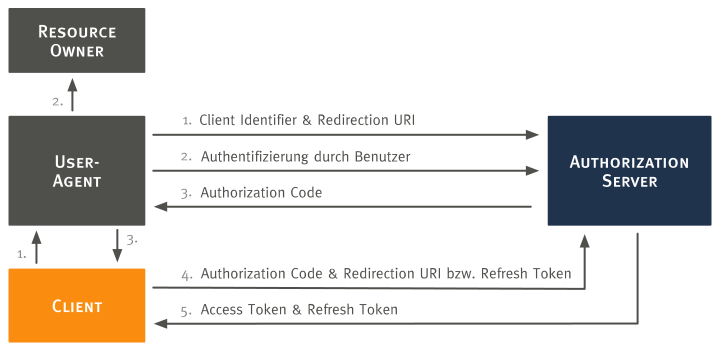

# App: `oauth2`

## Zweck

In der App sollte der häufig für Webapplikationen eingesetzte [Authorization Code Flow](https://tools.ietf.org/html/rfc6749#section-4.1) implementiert werden. Dazu mussten folgende User Stories umgesetzt werden:

* **Clientregistrierung:** Als ownCloud-Administrator möchte ich Clients in den Administrator-Einstellungen hinzufügen und löschen können, um die Kontrolle über erlaubte Clients zu haben.
* **Log-Einträge**: Als ownCloud-Administrator möchte ich durch Log-Einträge über Ereignisse zu OAuth 2.0 informiert werden.
* **Authorization URL:** Als Client-Entwickler möchte ich eine Authorization URL zur Verfügung haben, um Authorization Codes anfordern zu können.
* **Access Token URL:** Als Client-Entwickler möchte ich eine Access Token URL zur Verfügung haben, um Access Tokens anfordern zu können.
* **Verwaltung autorisierter Applikationen**: Als ownCloud-Nutzer möchte ich in den persönlichen Einstellungen autorisierte Applikationen verwalten können, um einen Überblick zu haben und Autorisierungen widerrufen zu können.

## Authorization Code Flow

Die nachfolgende Abbildung stellt den durch die `oauth2` App implementierten [OAuth 2.0 Authorization Code Flow](https://tools.ietf.org/html/rfc6749#section-4.1) dar.

> Anmerkung: Die Schritte 1, 2 und 3 sind zweigeteilt, da sie durch den User-Agent laufen.
 


<div align="right">
	<small>[vgl. <a href="https://tools.ietf.org/html/rfc6749#page-24">RFC 6749, S. 24</a>]</small>
</div>

Der Authorization Code Flow kann von jedem Client, der registriert ist, angestoßen werden. Zur Registrierung eines Clients gibt der Administrator in den ownCloud Einstellungen folgende Informationen an:

* Name des Clients: Zur Wiedererkennung
* Redirection URI: URI, an die nach erfolgter Autorisierung des Nutzers weitergeleitet wird.
* Umgang mit Subdomains: Zum Einstellen, ob Subdomains der Redirection URI erlaubt werden sollen.

Die App generiert daraufhin die Zugangsdaten des Clients, bestehend aus Client Identifier und Client Secret.

Im Flow sind folgende Rollen beteiligt:

* Client: Die Applikation, die für Zugriffe auf geschützte Ressourcen autorisiert werden möchte. In unserem Integrationsszenario: Moodle.
* Authorization Server: Die Applikation, die den Client für Zugriffe autorisiert. In unserem Integrationsszenario: ownCloud.
* Resource Owner: Der Eigentümer der geschützten Ressourcen. In unserem Integrationsszenario: ownCloud Nutzer.
* User Agent: Durch ihn erfolgt die Kommunikation zwischen Client, Resource Owner und Authorization Server. In unserem Integrationsszenario: ein Webbrowser.

Folgende Schritte werden durchlaufen:

1. Der Client initiiert den Flow durch Weiterleitung des Resource Owners an die Authorization URL `/index.php/apps/oauth2/authorize`. URL Parameter:
	* `response_type`: Da hier der Authorization Code Flow betrachtet wird, muss `code` angegeben werden.
	* `client_id`: Der Client Identifier aus der Clientregistrierung.
	* `redirect_uri`: Die Redirection URI aus der Clientregistrierung.
	* `state`: Kann vom Client optional angegeben werden, um die Anfrage bei Erhalt einer Antwort wiedererkennen zu können.
2. Der Resource Owner authentifiziert sich daraufhin beim Authorization Server und entscheidet über die Autorisierung des Clients.
3. Bei erfolgter Autorisierung, wird ein Authorization Code ausgestellt (ein Authorization Code ist für 10 Minuten gültig). Die App leitet dann an die Redirection URI weiter. URL Parameter:
	* `code`: Der ausgestellte Authorization Code.
	* `state`: optional, falls unter 1. angegeben.
4. Mit dem Authorization Code kann der Client ein Access Token anfordern. Dazu sendet er einen `POST`-Request an die Access Token URL `/index.php/apps/oauth2/api/v1/token`. Zusätzlich ist eine Client Authentifizierung mittels Basic Authentication (Nutzername: Client Identifier, Passwort: Client Secret) notwendig. URL Parameter:
	* `grant_type`: entweder `authorization_code` oder `refresh_token`
	* `code` und `redirect_uri` (falls `authorization_code` als Grant Type angegeben wurde)
	* `refresh_token` (falls `refresh_token` als Grant Type angegeben wurde)
5. Bei gültigen Angaben wird ein Access Token mit Refresh Token ausgestellt (ein Access Token ist für 1 Stunde gültig). Abgelaufene Access Tokens können mithilfe des Refresh Tokens gegen neue eingetauscht werden.

## Datenmodell

Zunächst musste ein Datenmodell zur Speicherung der benötigten Daten aufgestellt werden. Gemäß dem Authorization Code Flow wurden folgende Entitäten mit Attributen definiert:

* **[`client`](https://tools.ietf.org/html/rfc6749#section-1.1):** Die Applikation, die für den Zugriff auf die WebDAV Schnittstelle autorisiert werden soll.
	* `identifier`: Zeichenkette, die einen Client eindeutig identifiziert.
	* `secret`: Zeichenkette, mit der ein Client sich beim Anfordern eines Access Tokens authentifizieren kann.
	* `redirect_uri`: URI, an die nach erfolgter Autorisierung des Nutzers weitergeleitet wird.
	* `name`: Ein Name für den Client zur Wiedererkennung.
	* `allow_subdomains`: Zum Einstellen, ob Subdomains der `redirect_uri` erlaubt werden sollen.
* **[`authorization_code`](https://tools.ietf.org/html/rfc6749#section-1.3.1):** Ein [Authorization Grant](https://tools.ietf.org/html/rfc6749#section-1.3), 
mit dem der Client die Autorisierung des Nutzers darlegen und somit ein Access Token anfordern kann.
	* `code`: Zeichenkette, die als Authorization Code dient.
	* `client_id`: Client Identifier des Clients, für den der Authorization Code ausgegeben wird.
	* `user_id`: User ID des ownCloud-Nutzers, der den Client autorisiert hat.
	* `expires`: Zeitpunkt, zu dem der Authorization Code ungültig wird.
* **[`access_token`](https://tools.ietf.org/html/rfc6749#section-1.4):** Eine Zeichenkette, die den Zugriff auf die WebDAV Schnittstelle erlaubt.
	* `token`: Zeichenkette, die als Access Token dient.
	* `client_id`: Client Identifier des Clients, für den der Access Token ausgegeben wird.
	* `user_id`: User ID des ownCloud-Nutzers, der den Client autorisiert hat.
	* `expires`: Zeitpunkt, zu dem der Access Token ungültig wird.
* **[`refresh_token`](https://tools.ietf.org/html/rfc6749#section-1.5):** Eine Zeichenkette, mit der ein abgelaufener Access Token gegen einen neuen ausgetauscht werden kann.
	* `token`: Zeichenkette, die als Refresh Token dient.
	* `client_id`: Client Identifier des Clients, für den der Access Token ausgegeben wird.
	* `user_id`: User ID des ownCloud-Nutzers, der den Client autorisiert hat.

Folgendes Entity-Relationship-Modell fasst das Datenmodell grafisch zusammen.


## Vorgegebene Schnittstelle

Zur Erweiterung von ownCloud wird das Konzept von [Apps](https://doc.owncloud.org/server/9.1/developer_manual/app/) geboten. ownCloud Apps liegen im Verzeichnis `apps` einer ownCloud Installation und besitzen folgende [Struktur](https://doc.owncloud.org/server/9.1/developer_manual/app/startapp.html#app-architecture):

```nohighlight
appinfo
  ├── app.php				# Die erste Datei, die beim Laden der App ausgeführt wird
  ├── database.xml			# Definiert das Datenbankschema
  ├── info.xml				# Enthält Metadaten
  └── routes.php			# Definiert die Routes
css							# Enthält alle CSS-Dateien
img							# Enthält alle Bilder
js							# Enthält alle JavaScript-Dateien
l10n						# Enthält die Übersetzungen
lib							# Enthält alle Klassen-Dateien
  ├── Controller			# Enthält die Controller
  └── ...
templates					# Enthält die Templates
tests						# Enthält die Tests
```

Auf die Implementierung der Hauptbestandteile wird in den nächsten Abschnitten eingegangen.

## Implementierung

### Mapper und Entities

Für den Datenbank-Zugriff im PHP-Code ist es in ownCloud möglich, [Mapper](https://doc.owncloud.org/server/9.1/developer_manual/app/database.html#mappers) und 
[Entities](https://doc.owncloud.org/server/9.1/developer_manual/app/database.html#entities) zu schreiben. 
Dadurch werden Tupel in einer Datenbank-Tabelle automatisch in ein Objekt umgewandelt.

Folgendes Codebeispiel zeigt am Beispiel des Entitys `Client`, wie eine PHP-Klasse dazu aussehen muss.

```php
<?php
namespace OCA\OAuth2\Db;

use OCP\AppFramework\Db\Entity;

/**
 * @method string getIdentifier()
 * @method void setIdentifier(string $identifier)
 * @method string getSecret()
 * @method void setSecret(string $secret)
 * @method string getRedirectUri()
 * @method void setRedirectUri(string $redirectUri)
 * @method string getName()
 * @method void setName(string $name)
 * @method boolean getAllowSubdomains()
 * @method void setAllowSubdomains(boolean $value)
 */
class Client extends Entity {

	protected $identifier;
	protected $secret;
	protected $redirectUri;
	protected $name;
	protected $allowSubdomains;

	public function __construct() {
		$this->addType('id', 'int');
		$this->addType('identifier', 'string');
		$this->addType('secret', 'string');
		$this->addType('redirect_uri', 'string');
		$this->addType('name', 'string');
		$this->addType('allow_subdomains', 'boolean');
	}

}
```

Wichtig ist, dass die Klasse von [`Entity`](https://doc.owncloud.org/api/classes/OCP.AppFramework.Db.Entity.html) erbt und sowohl der Klassenname als auch die Attribute mit denen der Tabelle übereinstimmen. 
Pascal bzw. Camel case im PHP-Code wird automatisch zu Snake case für die Datenbank umgewandelt. 
Getter und Setter werden ebenfalls automatisch generiert. Die PHPDoc Kommentare dienen lediglich dazu, 
in der Entwicklungsumgebung eine automatische Vervollständigung zu haben. 
Die Angabe von [Typen](https://doc.owncloud.org/server/9.1/developer_manual/app/database.html#types) im Konstruktor dient dazu, 
beim Lesen aus der Datenbank die richtige Umwandlung zu erhalten.

Das folgende Codebeispiel zeigt einen Ausschnitt aus dem zur `Client`-Entity gehörenden Mapper.

```php
<?php
namespace OCA\OAuth2\Db;

use InvalidArgumentException;
use OCP\AppFramework\Db\Entity;
use OCP\AppFramework\Db\Mapper;
use OCP\IDb;

class ClientMapper extends Mapper {

	/**
	 * ClientMapper constructor.
	 *
	 * @param IDb $db Database Connection.
	 */
	public function __construct(IDb $db) {
		parent::__construct($db, 'oauth2_clients');
	}

	/**
	 * Selects a client by its ID.
	 *
	 * @param int $id The client's ID.
	 *
	 * @return Entity The client entity.
	 *
	 * @throws \OCP\AppFramework\Db\DoesNotExistException if not found.
	 * @throws \OCP\AppFramework\Db\MultipleObjectsReturnedException if more
	 * than one result.
	 */
	public function find($id) {
		if (!is_int($id)) {
			throw new InvalidArgumentException('id must not be null');
		}

		$sql = 'SELECT * FROM `' . $this->tableName . '` WHERE `id` = ?';
		return $this->findEntity($sql, [$id], null, null);
	}

	/**
	 * Selects clients by the given user ID.
	 *
	 * @param string $userId The user ID.
	 *
	 * @return array The client entities.
	 */
	public function findByUser($userId) {
		if (!is_string($userId)) {
			throw new InvalidArgumentException('userId must not be null');
		}

		$sql = 'SELECT * FROM `' . $this->tableName . '` '
			. 'WHERE `id` IN ( '
				. 'SELECT `client_id` FROM `oc_oauth2_authorization_codes` WHERE `user_id` = ? '
				. 'UNION '
				. 'SELECT `client_id` FROM `oc_oauth2_access_tokens` WHERE `user_id` = ? '
			. ')';
		return $this->findEntities($sql, [$userId, $userId], null, null);
	}

}
```

Beim Mapper ist es wichtig, dass die Klasse von [`Mapper`](https://doc.owncloud.org/api/classes/OCP.AppFramework.Db.Mapper.html) erbt und eine Entity-Klasse zu ihm existiert. 
Dazu wird das Wort vor „Mapper“ als Entityname verwendet. Im Konstruktur wird der Tabellenname angegeben. 
Die beiden Funktionen `find` und `findByUser` demonstrieren `SELECT`-Anweisungen. 
Dazu wird die SQL-Anweisung zusammen mit benötigten Parametern an `findEntity` bzw. `findEntities` übergeben, abhängig davon, ob mehrere Entities im Ergebnis enthalten sein sollten. 
Funktionen zum Löschen, Einfügen und Aktualisieren werden von der Oberklasse bereits implementiert und mussten nicht angepasst werden.

### Schnittstellen und Routes

Um in einer ownCloud App Schnittstellen anzubieten, müssen [Routes](https://doc.owncloud.org/server/9.1/developer_manual/app/routes.html) registriert werden. 
Zur Umsetzung der erwähnten User Stories waren folgende Routes notwendig:

| Methode | Endpunkt              | Beschreibung                                                                                              |
|---------|-----------------------|-----------------------------------------------------------------------------------------------------------|
| `GET`   | `authorize`           | Endpunkt, zu dem der Client den Nutzer weiterleitet, um die Autorisierung anzufragen (Authorization URL). |
| `POST`  | `authorize`           | Endpunkt, der aufgerufen wird, sobald der Nutzer den Client autorisiert hat.                              |
| `POST`  | `api/v1/token`        | Endpunkt, an dem ein Access Token angefordert wird (Access Token URL).                                    |
| `POST`  | `clients`             | Endpunkt, durch den der Administrator einen Client hinzufügen kann.                                       |
| `POST`  | `clients/{id}/delete` | Endpunkt, durch den der Administrator den Client mit der ID `id` löschen kann.                            |
| `POST`  | `clients/{id}/revoke` | Endpunkt, durch den der Nutzer die Autorisierung des Clients mit der ID `id` widerrufen kann.             |

Registriert werden die Routes in der Datei `routes.php`, indem ein Array mit den Routes zurückgegeben wird. Nachfolgendes Codebeispiel zeigt einige der obigen Routes:

```php
<?php
return [
	'routes' => [
		['name' => 'page#authorize', 'url' => '/authorize', 'verb' => 'GET'],
		['name' => 'o_auth_api#generate_token', 'url' => '/api/v1/token', 'verb' => 'POST'],
		['name' => 'settings#deleteClient', 'url' => '/clients/{id}/delete', 'verb' => 'POST']
    ]
];
```

Durch `name` wird für jede Route der Name des dazugehörigen [Controllers](#controller) sowie die aufzurufende Funktion angegeben: Vor dem `#`-Zeichen steht der Controllername in Snake case und hinter dem `#`-Zeichen steht der Funktionsname (ebenfalls in Snake case). Mithilfe von `url` wird der Endpunkt festgelegt und `verb` definiert die HTTP-Methode.

### Controller

Wenn an einem Endpunkt eine HTTP-Anfrage ankommt, so wird der in den Routes definierte [Controller](https://doc.owncloud.org/server/9.1/developer_manual/app/controllers.html) aufgerufen. Wichtig ist hierbei, dass von der Klasse [`Controller`](https://doc.owncloud.org/api/classes/OCP.AppFramework.Controller.html) oder 
einer Unterklasse wie [`ApiController`](https://doc.owncloud.org/api/classes/OCP.AppFramework.ApiController.html) geerbt wird.

Für den Controller notwendige Parameter wie [Mapper](#mapper-und-entities) können im Konstruktor als Parameter angegeben und so durch 
[Dependency Injection](https://doc.owncloud.org/server/9.1/developer_manual/app/container.html) erhalten werden. 
Nachfolgendes Codebeispiel zeigt den Konstruktor vom `PageController`.

```php
<?php
/**
 * PageController constructor.
 *
 * @param string $AppName The app's name.
 * @param IRequest $request The request.
 * @param ClientMapper $clientMapper The client mapper.
 * @param AuthorizationCodeMapper $authorizationCodeMapper The authorization code mapper.
 * @param AccessTokenMapper $accessTokenMapper The access token mapper.
 * @param RefreshTokenMapper $refreshTokenMapper The refresh token mapper.
 * @param string $UserId The user ID.
 * @param ILogger $logger The logger.
 */
public function __construct($AppName, IRequest $request,
							ClientMapper $clientMapper,
							AuthorizationCodeMapper $authorizationCodeMapper,
							AccessTokenMapper $accessTokenMapper,
							RefreshTokenMapper $refreshTokenMapper,
							$UserId,
							ILogger $logger) {
	parent::__construct($AppName, $request);

	$this->clientMapper = $clientMapper;
	$this->authorizationCodeMapper = $authorizationCodeMapper;
	$this->accessTokenMapper = $accessTokenMapper;
	$this->refreshTokenMapper = $refreshTokenMapper;
	$this->userId = $UserId;
	$this->logger = $logger;
}
```

Die hier notwendigen Parameter sind der Name der App, die Anfrage (Objekt, das die Schnittstelle `IRequest` implementiert), verschiedene Mapper Instanzen, die ID des Nutzers, 
um bei der Autorisierung des Clients speichern zu können, welcher Nutzer dies veranlasst hat, und ein Logger (Objekt, das die Schnittstelle `ILogger` implementiert). Letzterer ist notwendig um in die Log-Datei von ownCloud zu schreiben.

Die mit den Routes verknüpften Funktionen können zur Zugriffskontrolle mit [PHPDoc Annotationen](https://doc.owncloud.org/server/9.1/developer_manual/app/controllers.html#authentication) versehen werden. Folgendes Codebeispiel zeigt die Annotationen für die Funktion `generateToken` im `OAuthApiController`.

```php
<?php
/**
 * Implements the OAuth 2.0 Access Token Response.
 *
 * @param string $grant_type The authorization grant type.
 * @param string $code The authorization code.
 * @param string $redirect_uri The redirect URI.
 * @param string $refresh_token The refresh token.
 * @return JSONResponse The Access Token or an empty JSON Object.
 *
 * @NoAdminRequired
 * @NoCSRFRequired
 * @PublicPage
 * @CORS
 */
public function generateToken($grant_type, $code = null,
							  $redirect_uri = null, $refresh_token = null) { }
```

Die Annotationen haben dabei folgende Bedeutungen.

| Annotation         | Bedeutung                                                         |
|--------------------|-------------------------------------------------------------------|
| `@NoAdminRequired` | Aufruf auch von normalen Nutzern möglich.                         |
| `@NoCSRFRequired`  | Zeigt an, dass die Überprüfung des CSRF Tokens nicht gewollt ist. |
| `@PublicPage`      | Zugriff auch ohne Login möglich.                                  |
| `@CORS`            | Aufruf der API durch andere Web Applikationen von außen möglich.  |

In den Controller-Funktionen können verschiedene Inhalte zurückgegeben werden. Hier genutzte Rückgabetypen sind in der folgenden Tabelle zusammengefasst.

| Typ                                                                                                          | Beschreibung                                                        |
|--------------------------------------------------------------------------------------------------------------|---------------------------------------------------------------------|
| [`TemplateResponse`](https://doc.owncloud.org/server/9.1/developer_manual/app/controllers.html#templates) | Zur Rückgabe eines Templates, das dem Nutzer angezeigt werden soll. |
| [`RedirectResponse`](https://doc.owncloud.org/server/9.1/developer_manual/app/controllers.html#redirects) | Zur Weiterleitung des Nutzers an eine andere URL.                   |
| [`JSONResponse`](https://doc.owncloud.org/server/9.1/developer_manual/app/controllers.html#json)          | Zur Rückgabe eines JSON Strings.                                    |

Ein Beispiel für den Rückgabetyp `TemplateResponse` und gibt die Funktion `authorize` im `PageController`, die im folgenden Codebeispiel zu sehen ist.

```php
<?php
/**
 * Shows a view for the user to authorize a client.
 *
 * @param string $response_type The expected response type.
 * @param string $client_id The client identifier.
 * @param string $redirect_uri The redirection URI.
 * @param string $state The state.
 *
 * @return TemplateResponse|RedirectResponse The authorize view or a
 * redirection to the ownCloud main page.
 *
 * @NoAdminRequired
 * @NoCSRFRequired
 */
public function authorize($response_type, $client_id, $redirect_uri,
						  $state = null) {
	if (!is_string($response_type) || !is_string($client_id)
		|| !is_string($redirect_uri) || (isset($state) && !is_string($state))
	) {
		return new TemplateResponse(
			$this->appName,
			'authorize-error',
			['client_name' => null, 'back_url' => OC_Util::getDefaultPageUrl()]
		);
	}

	try {
		/** @var Client $client */
		$client = $this->clientMapper->findByIdentifier($client_id);
	} catch (DoesNotExistException $exception) {
		return new TemplateResponse(
			$this->appName,
			'authorize-error',
			['client_name' => null, 'back_url' => OC_Util::getDefaultPageUrl()]
		);
	}

	if (!Utilities::validateRedirectUri(
			$client->getRedirectUri(),
			urldecode($redirect_uri),
			$client->getAllowSubdomains())
	) {
		return new TemplateResponse(
			$this->appName,
			'authorize-error',
			['client_name' => $client->getName(), 'back_url' => OC_Util::getDefaultPageUrl()]
		);
	}

	if (strcmp($response_type, 'code') !== 0) {
		return new TemplateResponse(
			$this->appName,
			'authorize-error',
			['client_name' => $client->getName(), 'back_url' => OC_Util::getDefaultPageUrl()]
		);
	}

	return new TemplateResponse($this->appName, 'authorize', ['client_name' => $client->getName()]);
}
```

Hier werden zunächst die Parameter auf Gültigkeit überprüft. Sollten die Parameter nicht gültig sein (beispielsweise deshalb, weil der angegebene Client nicht existiert oder dessen Redirection URI falsch angegeben wurde), wird mit einem `TemplateResponse` das Template `authorize-error` zurückgegeben. Andernfalls kommt das Template `authorize` zum Einsatz. Für das Rendern des Templates können Parameter übergeben werden. Hier wurden die Parameter `client_name` für den Namen des Clients und `back_url` für die URL des Zurück-Buttons verwendet.

Der Rückgabetyp `RedirectResponse` wird für die Ausstellung eines Authorization Codes in der Funktion `generateAuthorizationCode` im `PageController` genutzt. Folgendes Codebeispiel macht dies deutlich. Zudem wird der Einsatz von Entities und Mappern gezeigt.

```php
<?php
/**
 * Implements the OAuth 2.0 Authorization Response.
 *
 * @param string $response_type The expected response type.
 * @param string $client_id The client identifier.
 * @param string $redirect_uri The redirection URI.
 * @param string $state The state.
 *
 * @return RedirectResponse|JSONResponse Redirection to the given
 * redirect_uri or a JSON with an error message.
 *
 * @NoAdminRequired
 * @NoCSRFRequired
 */
public function generateAuthorizationCode($response_type, $client_id, $redirect_uri, $state = null) {
	if (!is_string($response_type) || !is_string($client_id)
		|| !is_string($redirect_uri) || (isset($state) && !is_string($state))
	) {
		return new RedirectResponse(OC_Util::getDefaultPageUrl());
	}

	switch ($response_type) {
		case 'code':
			try {
				/** @var Client $client */
				$client = $this->clientMapper->findByIdentifier($client_id);
			} catch (DoesNotExistException $exception) {
				return new RedirectResponse(OC_Util::getDefaultPageUrl());
			}

			if (!Utilities::validateRedirectUri(
					$client->getRedirectUri(),
					urldecode($redirect_uri),
					$client->getAllowSubdomains())
			) {
				return new RedirectResponse(OC_Util::getDefaultPageUrl());
			}

			$this->authorizationCodeMapper->deleteByClientUser($client->getId(), $this->userId);
			$this->accessTokenMapper->deleteByClientUser($client->getId(), $this->userId);
			$this->refreshTokenMapper->deleteByClientUser($client->getId(), $this->userId);

			$code = Utilities::generateRandom();
			$authorizationCode = new AuthorizationCode();
			$authorizationCode->setCode($code);
			$authorizationCode->setClientId($client->getId());
			$authorizationCode->setUserId($this->userId);
			$authorizationCode->resetExpires();
			$this->authorizationCodeMapper->insert($authorizationCode);

			$result = urldecode($redirect_uri);
			$result = $result . '?code=' . $code;
			if (!is_null($state)) {
				$result = $result . '&state=' . urlencode($state);
			}

			$this->logger->info(
				'An authorization code has been issued for the client "' . $client->getName() .'".',
				['app' => $this->appName]
			);

			return new RedirectResponse($result);
		default:
			return new RedirectResponse(OC_Util::getDefaultPageUrl());
	}
}
```

In dieser Funktion werden die Parameter überprüft. Falls diese nicht gültig sind (beispielsweise deshalb, 
weil der angegebene Client nicht existiert oder dessen Redirection URI falsch angegeben wurde), wird an die ownCloud Startseite weitergeleitet. 
Ansonsten wird ein Authorization Code ausgestellt und als Parameter der Redirection URI angehängt, zu welcher schließlich weitergeleitet wird.

Der Rückgabetyp `JSONResponse` wird für die Rückgabe des Access Tokens in der Funktion `generateToken` im `OAuthApiController` genutzt, wie nachfolgendes Codebeispiel zeigt. Zudem ist erneut das Zusammenspiel mit Entities und Mappern zu sehen.

```php
<?php
/**
 * Implements the OAuth 2.0 Access Token Response.
 *
 * @param string $grant_type The authorization grant type.
 * @param string $code The authorization code.
 * @param string $redirect_uri The redirect URI.
 * @param string $refresh_token The refresh token.
 * @return JSONResponse The Access Token or an empty JSON Object.
 *
 * @NoAdminRequired
 * @NoCSRFRequired
 * @PublicPage
 * @CORS
 */
public function generateToken($grant_type, $code = null,
							  $redirect_uri = null, $refresh_token = null) {
	if (!is_string($grant_type)) {
		return new JSONResponse(['error' => 'invalid_request'], Http::STATUS_BAD_REQUEST);
	}

	if (is_null($_SERVER['PHP_AUTH_USER']) || is_null($_SERVER['PHP_AUTH_PW'])) {
		return new JSONResponse(['error' => 'invalid_request'], Http::STATUS_BAD_REQUEST);
	}

	try {
		/** @var Client $client */
		$client = $this->clientMapper->findByIdentifier($_SERVER['PHP_AUTH_USER']);
	} catch (DoesNotExistException $exception) {
		return new JSONResponse(['error' => 'invalid_client'], Http::STATUS_BAD_REQUEST);
	}

	if (strcmp($client->getSecret(), $_SERVER['PHP_AUTH_PW']) !== 0) {
		return new JSONResponse(['error' => 'invalid_client'], Http::STATUS_BAD_REQUEST);
	}

	switch ($grant_type) {
		case 'authorization_code':
			if (!is_string($code) || !is_string($redirect_uri)) {
				return new JSONResponse(['error' => 'invalid_request'], Http::STATUS_BAD_REQUEST);
			}

			try {
				/** @var AuthorizationCode $authorizationCode */
				$authorizationCode = $this->authorizationCodeMapper->findByCode($code);
			} catch (DoesNotExistException $exception) {
				return new JSONResponse(['error' => 'invalid_grant'], Http::STATUS_BAD_REQUEST);
			}

			if (strcmp($authorizationCode->getClientId(), $client->getId()) !== 0) {
				return new JSONResponse(['error' => 'invalid_grant'], Http::STATUS_BAD_REQUEST);
			}

			if ($authorizationCode->hasExpired()) {
				return new JSONResponse(['error' => 'invalid_grant'], Http::STATUS_BAD_REQUEST);
			}

			if (!Utilities::validateRedirectUri(
					$client->getRedirectUri(),
					urldecode($redirect_uri),
					$client->getAllowSubdomains())
			) {
				return new JSONResponse(['error' => 'invalid_grant'], Http::STATUS_BAD_REQUEST);
			}

			$this->logger->info(
				'An authorization code has been used by the client "'
					. $client->getName() . '" to request an access token.',
				['app' => $this->appName]
			);

			$userId = $authorizationCode->getUserId();
			break;
		case 'refresh_token':
			if (!is_string($refresh_token)) {
				return new JSONResponse(['error' => 'invalid_request'], Http::STATUS_BAD_REQUEST);
			}

			try {
				/** @var RefreshToken $refreshToken */
				$refreshToken = $this->refreshTokenMapper->findByToken($refresh_token);
			} catch (DoesNotExistException $exception) {
				return new JSONResponse(['error' => 'invalid_grant'], Http::STATUS_BAD_REQUEST);
			}

			if (strcmp($refreshToken->getClientId(), $client->getId()) !== 0) {
				return new JSONResponse(['error' => 'invalid_grant'], Http::STATUS_BAD_REQUEST);
			}

			$this->logger->info(
				'A refresh token has been used by the client "'
					. $client->getName() . '" to request an access token.',
				['app' => $this->appName]
			);

			$userId = $refreshToken->getUserId();
			break;
		default:
			return new JSONResponse(['error' => 'invalid_grant'], Http::STATUS_BAD_REQUEST);
	}

	$this->authorizationCodeMapper->deleteByClientUser($client->getId(), $userId);
	$this->accessTokenMapper->deleteByClientUser($client->getId(), $userId);
	$this->refreshTokenMapper->deleteByClientUser($client->getId(), $userId);

	$token = Utilities::generateRandom();
	$accessToken = new AccessToken();
	$accessToken->setToken($token);
	$accessToken->setClientId($client->getId());
	$accessToken->setUserId($userId);
	$accessToken->resetExpires();
	$this->accessTokenMapper->insert($accessToken);

	$token = Utilities::generateRandom();
	$refreshToken = new RefreshToken();
	$refreshToken->setToken($token);
	$refreshToken->setClientId($client->getId());
	$refreshToken->setUserId($userId);
	$this->refreshTokenMapper->insert($refreshToken);

	return new JSONResponse(
		[
			'access_token' => $accessToken->getToken(),
			'token_type' => 'Bearer',
			'expires_in' => 3600,
			'refresh_token' => $refreshToken->getToken(),
			'user_id' => $userId
		]
	);
}
```

Hier werden zunächst die Parameter auf Gültigkeit überprüft. Dabei gibt es die zwei Fälle `authorization_code` und `refresh_token`, 
die durch die `switch`-Anweisung abgedeckt werden. Bei fehlerhaften Angaben wird eine entsprechende Fehlermeldung im JSON-Format zurückgegeben. 
Andernfalls wird eine neuer Access Token erstellt und in der Datenbank gespeichert. Der verwendete Authorization Code bzw. der Refresh Token wird zudem gelöscht. 
Im JSON Response wird dann der Access Token, der Token Typ (`Bearer` wegen des Authorization Code Flow), die Lebensdauer, der Refresh Token und die ID des Nutzers zurückgegeben. Nachfolgend ist ein Beispiel dazu angegeben.

```json
{
	"access_token" : "1vtnuo1NkIsbndAjVnhl7y0wJha59JyaAiFIVQDvcBY2uvKmj5EPBEhss0pauzdQ",
	"token_type" : "Bearer",
	"expires_in" : 3600,
	"refresh_token" : "7y0wJuvKmj5E1vjVnhlPBEhha59JyaAiFIVQDvcBY2ss0pauzdQtnuo1NkIsbndA",
	"user_id" : "admin"
}
```

Für die Token-Generierung wurde die Hilfsklasse `Utilities` mit der statischen Funktion `generateRandom` geschrieben, die mithilfe einer ownCloud-internen Funktion 64-stellige zufällige Zeichenketten erzeugt. Folgendes Codebeispiel zeigt diese Funktion.

```php
<?php
/**
 * Generates a random string with 64 characters.
 *
 * @return string The random string.
 */
public static function generateRandom() {
    return \OC::$server->getSecureRandom()->generate(64,
        'ABCDEFGHIJKLMNOPQRSTUVWXYZabcdefghijklmnopqrstuvwxyz0123456789');
}
```

Zusammenfassend werden im folgenden UML-Klassendiagramm die Controller mit ihren Beziehungen, die Entities und die Mapper, sowie die Klasse `Utilities` dargestellt.


### Templates

In den [Templates](https://doc.owncloud.org/server/9.1/developer_manual/app/templates.html) einer ownCloud App wird die für den Nutzer sichtbare Oberfläche definiert. Es können die vom [Controller](#controller) übergebenen Parameter genutzt werden. Dazu gibt es ein Array mit dem Namen `$_`. Zur Vermeidung von Cross-Site-Scripting existiert zudem die ownCloud-interne Funktion `p()`, mithilfe derer Werte ausgegeben werden können.

Folgende Templates wurden in der App definiert:

* **`authorize`**: Zur Darstellung des Authorization Requests, bei dem der Nutzer um Autorisierung eines Clients gebeten wird. Es werden ein Text zur Erklärung sowie Buttons zum Akzeptieren oder Ablehnen angezeigt.
* **`authorize-error`**: Zur Information des Nutzers mit einer Fehlermeldung, falls der Authorization Request wegen fehlerhafter Parameter ungültig ist.
* **`settings-admin`**: Stellt zur Verwaltung der Clients eine tabellarische Auflistung der Clients sowie ein Formular zum Hinzufügen von Clients dar.
* **`settings-personal`**: Stellt eine tabellarische Auflistung der vom Nutzer autorisierten Clients dar, mit der Möglichkeit, die Autorisierung zu widerrufen.

Folgendes Codebeispiel zeigt das Template `settings-admin`.

```php
<?php
/** @var \OCA\OAuth2\Db\Client $client */
script('oauth2', 'settings');
style('oauth2', 'main');
style('oauth2', 'settings-admin');
?>

<div class="section" id="oauth2">
    <h2><?php p($l->t('OAuth 2.0')); ?></h2>

    <h3><?php p($l->t('Registered clients')); ?></h3>
    <?php if (empty($_['clients'])) {
        p($l->t('No clients registered.'));
    }
    else { ?>
    <table class="grid">
        <thead>
        <tr>
            <th id="headerName" scope="col"><?php p($l->t('Name')); ?></th>
            <th id="headerRedirectUri" scope="col"><?php p($l->t('Redirection URI')); ?></th>
            <th id="headerClientIdentifier" scope="col"><?php p($l->t('Client Identifier')); ?></th>
            <th id="headerSecret" scope="col"><?php p($l->t('Secret')); ?></th>
			<th id="headerSubdomains" scope="col"><?php p($l->t('Subdomains allowed')); ?></th>
            <th id="headerRemove">&nbsp;</th>
        </tr>
        </thead>
        <tbody>
            <?php foreach ($_['clients'] as $client) { ?>
                <tr>
                    <td><?php p($client->getName()); ?></td>
                    <td><?php p($client->getRedirectUri()); ?></td>
                    <td><code><?php p($client->getIdentifier()); ?></code></td>
                    <td><code><?php p($client->getSecret()); ?></code></td>
						<td id="td-allow-subdomains">
							<?php if ($client->getAllowSubdomains()) {?>
								
							<?php } ?>
						</td>
                    <td>
                        <form id="form-inline" class="delete"
                        	data-confirm="<?php
                        		p($l->t('Are you sure you want to delete this item?'));
                        	?>"
                        	action="../apps/oauth2/clients/<?php p($client->getId()); ?>/delete"
                        	method="post">
                            <input type="submit" class="button icon-delete" value="">
                        </form>
                    </td>
                </tr>
            <?php } ?>
        </tbody>
    </table>
    <?php } ?>

    <h3><?php p($l->t('Add client')); ?></h3>
    <form action="../apps/oauth2/clients" method="post">
		<input id="name" name="name" type="text" placeholder="<?php p($l->t('Name')); ?>">
        <input id="redirect_uri" name="redirect_uri" type="url"
        	placeholder="<?php p($l->t('Redirection URI')); ?>">
		<input type="checkbox" class="checkbox" name="allow_subdomains"
			id="allow_subdomains" value="1"/>
		<label for="allow_subdomains"><?php p($l->t('Allow subdomains'));?></label>
        <input type="submit" class="button" value="<?php p($l->t('Add')); ?>">
    </form>
</div>
```

In diesem Template wird eine Tabelle mit den registrierten Clients angezeigt. Zu Beginn werden mit den Funktionen `script` und `style` zusätzliche JavaScript- bzw. CSS-Dateien aus den Verzeichnissen `js` bzw. `css` geladen. Durch eine `for`-Schleife wird dann für jeden Client aus dem Parameter `clients` ein Tabelleneintrag angezeigt. Sollten noch keine Clients registriert worden sein, sorgt die `if`-Anweisung dafür, dass die Meldung „No clients registered“ angezeigt wird. Durch Nutzung der Funktion `t` der globalen Variable `$l` können die Strings auch [in andere Sprachen Übersetzt werden](https://doc.owncloud.org/server/9.1/developer_manual/app/l10n.html#templates). Im Zuge des Transfers der App in die ownCloud GitHub-Organisation wurde Transifex als Übersetzungsplattform integriert. Dies bedeutet, dass nun im `l1on`-Verzeichnis der OAuth 2.0 App Übersetzungen der originalen (von uns erstellten) englischen Strings aus den Templates von der Transifex-Community hinzugefügt und geändert werden können. Dadurch liegen bereits zum aktuellen Zeitpunkt über 15 Übersetzungen der App vor. Diese werden je nach Spracheinstellung der ownCloud-Instanz angezeigt. Des Weiteren gibt es unter der Tabelle ein Formular für das Hinzufügen von Clients. Die in dem Formular angegebene Aktion löst die Funktion `addClient` im `SettingsController` aus. Analog dazu gibt es für jeden Tabelleneintrag ein Formular zum Löschen des Eintrags, das die Funktion `deleteClient` im `SettingsController` auslöst.

### Hooks

Bei der Implementierung der App mussten wir bedenken, dass Nutzer aus ownCloud auch gelöscht werden können. Deshalb musste sichergestellt werden, dass beim Löschen eines Nutzers auch alle mit ihm verknüpften Authorization Codes, Access Tokens und Refresh Tokens gelöscht werden.

Hierfür gibt es in ownCloud das Konzept der [Hooks](https://doc.owncloud.org/server/9.1/developer_manual/app/hooks.html), welche bei bestimmten Ereignissen ausgelöst werden. Eigene Hooks werden in der `app.php` registriert.

Da wir vor dem Löschen eines Nutzers eine Datenbankbereinigung durchführen müssen, war der `preDelete`-Hook von Interesse. Dazu wurde die Klasse `UserHooks` implementiert. Folgendes Codebeispiel zeigt dessen Funktion `register`, in der die vor dem Löschen durchzuführenden Aktionen definiert werden.

```php
/**
 * Registers a pre-delete hook for users to delete authorization codes,
 * access tokens and refresh tokens that reference the user.
 */
public function register() {
	/**
	 * @param User $user .
	 */
	$callback = function ($user) {
		if (!is_null($user->getUID())) {
			$this->logger->info(
				'Deleting authorization codes, access tokens and refresh tokens referencing the user to be deleted "' . $user->getUID() . '".',
				['app' => $this->appName]);

			$this->authorizationCodeMapper->deleteByUser($user->getUID());
			$this->accessTokenMapper->deleteByUser($user->getUID());
			$this->refreshTokenMapper->deleteByUser($user->getUID());
		}
	};

	$this->userManager->listen('\OC\User', 'preDelete', $callback);
}
```

Hier wird mithilfe des ownCloud-internen `UserManager`s ein Callback für den `preDelete`-Hook registriert. In dem Callback werden nach Erstellung eines Log-Eintrags mithilfe der Mapper alle Datenbank-Einträge zu dem Nutzer gelöscht. Dazu wurde die Funktion `deleteByUser` im `AuthorizationCodeMapper`, `AccessTokenMapper` und `RefreshTokenMapper` implementiert.

### Background Job

Da Authorization Codes und Access Tokens eine begrenzte Lebensdauer haben, entstehen mit der Zeit ungenutzte Einträge in der Datenbank. Zur Bereinigung wurde ein [Background Job](https://doc.owncloud.org/server/9.1/developer_manual/app/backgroundjobs.html) erstellt, der regelmäßig ausgeführt wird. Die Registrierung erfolgt dabei auch in der `app.php`. Folgendes Codebeispiel zeigt die Implementierung der Klasse `CleanUp`, in der der auszuführende Code definiert wird.

```php
<?php
namespace OCA\OAuth2\BackgroundJob;

use OCA\OAuth2\AppInfo\Application;

class CleanUp {

	/**
	 * Cleans up expired authorization codes and access tokens.
	 */
	public static function run() {
		$app = new Application();
		$container = $app->getContainer();

		$container->query('OCA\OAuth2\Db\AuthorizationCodeMapper')->cleanUp();
		$container->query('OCA\OAuth2\Db\AccessTokenMapper')->cleanUp();
	}

}
```

Bei Ausführung des Background Jobs wird die `run` Methode aufgerufen. Hier werden über den [Container](https://doc.owncloud.org/server/9.1/developer_manual/app/container.html) der App der `AuthorizationCodeMapper` und `AccessTokenMapper` abgefragt, sowie deren `cleanUp` Funktion aufgerufen. In dieser Funktion werden alle Einträge, die vor einer Woche abgelaufen sind, aus der Datenbank gelöscht.

### Logging

Zur Information des Administrators wird bei folgenden Ereignissen in die Log-Datei geschrieben:

* Hinzufügen bzw. Löschen von Clients.
* Ausstellung von Authorization Codes.
* Einlösung von Authorization Codes bzw. Refresh Tokens.
* Bereinigung der Datenbank von abgelaufenen Authorization Codes bzw. Access Tokens.

Als Log-Level wurde `info` gewählt.


### Authentifizierungslogik

Nach der Implementierung des OAuth 2.0 Protokolls musste die Authentifizierung von WebDAV und von ownCloud APIs (für die Nutzung der OCS Share API) Erweitert werden. Diese Erweiterung basiert auf den durchgeführten [Core Anpassungen](core-anpassungen).

Zunächst sahen wir uns die Umsetzung der bestehenden Basic Authentication in der `dav` App an. Dabei stellten wir fest, dass sabre den [Austausch des Authentifizierungsmechanismus](http://sabre.io/dav/authentication/) durch Implementierung eines Interfaces bietet. Für unser Szenario war das Interface `AbstractBearer` relevant, da die Access Tokens aus dem Authorization Code Flow des OAuth 2.0 Protokolls für Bearer Authentication genutzt werden. Dazu haben wir die Funktion `validateBearerToken` in der Klasse `OAuth2` implementieren. Die Logik und das Session-Management lehnen sich stark an die bestehende Implementierung der Basic Authentication an. Für die Authentifizierung einer Anfrage wird hier jedoch auf `AuthModule`s zurückgegriffen.

Ein `AuthModule` kann von ownCloud Apps implementiert und registriert werden. Es wird auch bei der Authentifizierung von API Zugriffen eingesetzt. Eine App muss dazu die Funktionen `auth` und `getUserPassword` implementieren. Erstere authentifiziert eine Anfrage, während letztere das Passwort des Nutzers zu einer Anfrage ermittelt. Da die App `encryption` in bestimmten Nutzungsszenarien auf das Passwort des Nutzers angewiesen ist, existiert die Funktion `getUserPassword`. Sie gibt jedoch in unserer Implementierung eine leere Zeichenkette zurück, da wir an keiner Stelle mit Passwörtern umgehen (siehe [Einschränkungen](#einschrankungen)). `getUserPassword` gibt bei erfolgreicher Authentifizierung ein `User`-Objekt zurück, wie in folgendem Codebeispiel zu sehen ist.

```php
<?php
/**
 * Authenticates a request.
 *
 * @param IRequest $request The request.
 *
 * @return null|IUser The user if the request is authenticated, null otherwise.
 */
public function auth(IRequest $request) {
	$authHeader = $request->getHeader('Authorization');
	if (strpos($authHeader, 'Bearer ') === false) {
		return null;
	} else {
		$bearerToken = substr($authHeader, 7);
	}
	$app = new Application();
	$container = $app->getContainer();
	/** @var AccessTokenMapper $accessTokenMapper */
	$accessTokenMapper = $container->query('OCA\OAuth2\Db\AccessTokenMapper');
	try {
		/** @var AccessToken $accessToken */
		$accessToken = $accessTokenMapper->findByToken($bearerToken);
		if ($accessToken->hasExpired()) {
			return null;
		}
	} catch (DoesNotExistException $exception) {
		return null;
	}
	/** @var IUserManager $userManager */
	$userManager = $container->query('UserManager');
	$user = $userManager->get($accessToken->getUserId());
	return $user;
}
``` 

Nach Extraktion des Bearer Tokens aus den Authorization Header, wird durch Rückgriff auf den `AccessTokenMapper` die `user_id` ermittelt. Mithilfe des ownCloud-internen `UserManager`s kann daraufhin das `User`-Objekt abgefragt werden.

Zur Registrierung eines `AuthModules` muss dessen Namespace in der [`info.xml`](https://doc.owncloud.org/server/9.1/developer_manual/app/info.html) angegeben werden, wie im folgenden Codebeispiel gezeigt wird:

```xml
<auth-modules>
  <module>OCA\OAuth2\AuthModule</module>
</auth-modules>
```

Damit die OAuth 2.0 Implementierung für die Authentifizierung in der `dav` App genutzt werden kann, musste sie für diese bekannt gemacht werden. Dazu wurde im Konstruktur der Klasse `Application`, von der in der `app.php` eine Instanz erzeugt wird, ein Event Listener hinzugefügt, der das `authInit`-Event des WebDAV-Server abgreift. Folgendes Codebeispiel macht dies deutlich.

```php
<?php
$dispatcher = $this->getContainer()->getServer()->getEventDispatcher();
$dispatcher->addListener('OCA\DAV\Connector\Sabre::authInit', function ($event) use ($container) {
	if ($event instanceof SabrePluginEvent) {
		$authPlugin = $event->getServer()->getPlugin('auth');
		if ($authPlugin instanceof Plugin) {
			$authPlugin->addBackend(
				new OAuth2(\OC::$server->getSession(),
					\OC::$server->getUserSession(),
					\OC::$server->getRequest(),
					'principals/')
			);
		}
	}
});
```

Beim Auslösen des `authInit`-Events wird der hier definierte Code ausgeführt, der dafür sorgt, dass ein zusätzliches Backend für die Authentifizierung mittels OAuth 2.0 hinzugefügt wird. Da die App damit ein Authentication Backend bereitstellt, war es notwendig, dies in der `info.xml` bei den [Types](https://doc.owncloud.org/server/9.1/developer_manual/app/info.html#types) bekanntzugeben, wie folgendes Codebeispiel zeigt.

```xml
<types>
	<authentication/>
</types>
```

## Tests und Continuous Integration

Zum Testen der PHP-Klassen wurde das Framework [PHPUnit](https://phpunit.de/) verwendet. Die aktuelle Testabdeckung ist bei Codecov einsehbar: [](https://codecov.io/gh/owncloud/oauth2).

Als Continuous Integration Tool wurde Travis CI verwendet. Bei jeder Änderung im [GitHub Repository](https://github.com/owncloud/oauth2) wird ein Build angestoßen, in dem die App mithilfe eines Makefiles für den App Store gebaut wird und anschließend in verschiedenen Umgebungen installiert und getestet wird. Folgende Parameter werden variiert:

* **PHP Versionen**: 5.6, 7.0, 7.1, nightly
* **Datenbanken**: PostgreSQL, MySQL, SQLite
* **Branches des ownCloud Core**: `master`

Der aktuelle Build-Status ist bei Travis einsehbar: [](https://travis-ci.org/owncloud/oauth2).

## Einschränkungen

Da in der App nicht mit Passwörtern des Nutzers umgegangen wird, können beim Login eines Nutzers der `preLogin`- und der `postLogin`-Hook nicht mit dem Passwort des Nutzers ausgelöst werden. Dies führt dazu, dass die `encryption` App nur mit der Master Key Encryption genutzt werden kann.
