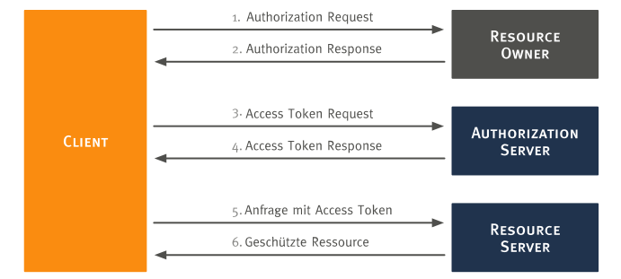

# OAuth 2.0

Wie [eingangs begründet](../../#authentifizierung-und-autorisierung), wurde OAuth 2.0 als Verfahren für die Authentifizierung und Autorisierung zwischen den beiden Systemen Moodle und ownCloud gewählt. Diese Seite erläutert den [allgemeinen Protokollablauf](#allgemeiner-protokollablauf) und den speziellen, durch die `oauth2` App implementierten [Authorization Code Flow](#authorization-code-flow).

## Allgemeiner Protokollablauf

Der allgemeine [OAuth 2.0 Protokollablauf](https://tools.ietf.org/html/rfc6749#section-1.2) ist in der nachfolgenden Abbildung dargestellt.

Zunächst muss sich der Client (Learnweb), der im Namen des Resource Owners (ownCloud Nutzer) auf eine geschützte Ressource auf dem Resource Server (sciebo) zugreifen möchte,
bei dem Authorization Server (ownCloud) registrieren. Danach werden nach dem Protokoll folgende Schritte durchlaufen:

1. Authorization Request: Der Client fordert eine Autorisierung vom Resource Owner an.
2. Authorization Response: Der Client erhält eine Autorisierungsgenehmigung vom Resource Owner. Die Autorisierung kann über eine
der vier Autorisierungsgenehmigungen (authorization grant type) erfolgen, oder es wird ein erweiterer Genehmigungsprozess verwendet.
3. Access Token Request: Der Client fordert ein Access Token vom Authorization Server an. Hierfür nutzt er die Autorisierungsgenehmigung vom Resource Owner.
4. Access Token Response: Der Authorization Server authentifiziert den Client und prüft die Autorisierungsgenehmigung.
Ist die Prüfung erfolgreich, wird ein Access Token ausgestellt.
5. Anfrage mittels Access Token: Der Client fragt die geschützten Daten beim Resource Server an. Zur Authentifizierung benutzt er den Access Token.
6. Zugriff auf geschützte Ressourcen: Der Resource Server prüft den Access Token und stellt, wenn gültig, die gewünschten Daten zur Verfügung.
