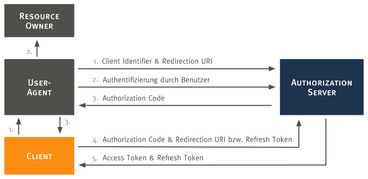

# OAuth 2.0

Wie [eingangs begründet](../../#authentifizierung-und-autorisierung), wurde OAuth 2.0 als Verfahren für die Authentifizierung und Autorisierung zwischen den beiden Systemen Moodle und ownCloud gewählt. Diese Seite erläutert den [allgemeinen Protokollablauf](#allgemeiner-protokollablauf) und den speziellen, durch die `oauth2` App implementierten [Authorization Code Flow](#authorization-code-flow).

## Allgemeiner Protokollablauf

Der allgemeine [OAuth 2.0 Protokollablauf](https://tools.ietf.org/html/rfc6749#section-1.2) ist in der nachfolgenden Abbildung dargestellt.

Zunächst muss sich der Client (Learnweb), der im Namen des Resource Owners (ownCloud Nutzer) auf eine geschützte Ressource auf dem Resource Server (sciebo) zugreifen möchte,
bei dem Authorization Server (ownCloud) registrieren. Danach werden nach dem Protokoll folgende Schritte durchlaufen:

1. Authorization Request: Der Client fordert eine Autorisierung vom Resource Owner an.
2. Authorization Response: Der Client erhält eine Autorisierungsgenehmigung vom Resource Owner. Die Autorisierung kann über eine
der vier Autorisierungsgenehmigungen (authorization grant type) erfolgen, oder es wird ein erweiterer Genehmigungsprozess verwendet.
3. Access Token Request: Der Client fordert ein Access Token vom Authorization Server an. Hierfür nutzt er die Autorisierungsgenehmigung vom Resource Owner.
4. Access Token Response: Der Authorization Server authentifiziert den Client und prüft die Autorisierungsgenehmigung.
Ist die Prüfung erfolgreich, wird ein Access Token ausgestellt.
5. Anfrage mittels Access Token: Der Client fragt die geschützten Daten beim Resource Server an. Zur Authentifizierung benutzt er den Access Token.
6. Zugriff auf geschützte Ressourcen: Der Resource Server prüft den Access Token und stellt, wenn gültig, die gewünschten Daten zur Verfügung.

## Authorization Code Flow

Die nachfolgende Abbildung stellt den durch die `oauth2` App implementierten [OAuth 2.0 Authorization Code Flow](https://tools.ietf.org/html/rfc6749#section-4.1) dar.
 

Anmerkung: Die Schritte 1, 2 und 3 sind zweigeteilt, da sie durch den User-Agent laufen.

Der dargestellte Authorization Code Flow beinhaltet die folgenden Schritte:

1. Client Identifier & Redirection URI: Der Client (hier Learnweb) initiiert den Flow durch die Weiterleitung des User-Agents des Resource Owners
zum Authorization Endpoint. Der Client fügt seinen Client Identifier, das angefragte Scope, Status und eine `redirection URI` an, zu welcher der
User-Agent vom Authorization Server (hier sciebo) zurückgeleitet wird, wenn der Zugriff gestattet, oder abgelehnt wurde.
2. Authentifizierung durch Benutzer: Der Authorization Server authentifiziert den Resource Owner (über den User-Agent) und stellt fest,
ob der Resource Owner die Zugriffsanfrage des Clients zulässt oder ablehnt.
3. Authorization Code: Vorausgesetzt der Resource Owner erlaubt den Zugriff, so leitet der Authorization Server den User-Agent zurück zum Client,
wozu die vorher (in der Anfrage oder während der Clientregistrierung) bereitgestellte `redirection URI` genutzt wird. Die 
`redirection URI` beinhaltet einen `authorization code` und jeglichen vom Client im Vorhinein bereitgestellten Status.
4. Authorization Code & Redirection URI: Der Client fragt ein Access Token vom Endpunkt des Authorization Servers an, indem
der Authorization Code aus dem vorherigen Schritt angefügt wird. Wenn die Anfrage durchgeführt wird, authentifiziert sich der Client
automatisch mit dem Authorization Server. Der Client fügt die für den Erhalt des `authorization codes` genutzte `redirection URI`
zur Verifizierung an.
5. Access Token (& optional: Refresh Token): Der Authorization Server authentifiziert den Client, validiert den `authorization code`, und
prüft, dass die empfangene `redirection URI` mit der zur Weiterleitung im dritten Schritt ("Authorization Code") genutzte URI übereinstimmt.
Wenn die Überprüfung erfolgreich verläuft, antwortet der Authorization Server mit einem `access token` und optional mit einem `refresh token`.
